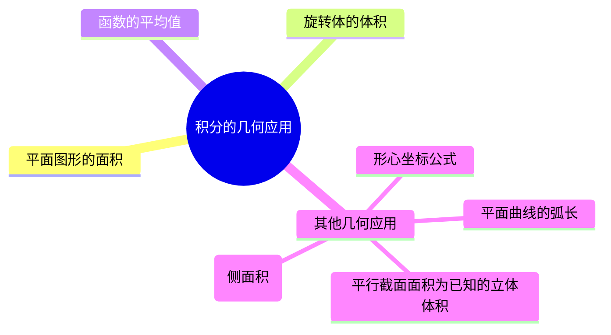

## 基础知识结构

## 1. 用定积分表达和计算平面图形的面积

1. 曲线 $y=y_{1} \left ( x \right ) $ 和 $y=y_{2} \left ( x \right ) $ 及 $x=a$, $x=b \left ( a < b \right )$ 所围成的平面图形的面积

$$
S=\int_{a}^{b} \left | y_{1} \left ( x \right ) - y_{2} \left ( x \right ) \right |dx
$$

2. 曲线 $r=r_{1} \left ( \theta \right ) $ 和 $r=r_{2} \left ( \theta \right ) $ 与两射线 $\theta = \alpha $ 与 $\theta = \beta \left ( 0 < \beta - \alpha \le 2\pi  \right )$ 所围城的曲边扇形的面积

$$
S=\frac{1}{2} \int_{\alpha}^{\beta} \left | r_{1}^{2}  \left ( \theta \right ) - r_{2}^{2} \left ( \theta \right ) \right |d\theta
$$

3. 参数方程就是使用换元法套直角坐标系的面积公式

$$
S=\int_{a}^{b} f\left ( x \right )  dx \xlongequal{x=x\left ( t \right ) } \int_{x^{-1}\left ( a \right )  }^{x^{-1}\left ( b \right ) }f\left [ x\left ( t \right )  \right ]d\left [ x\left ( t \right )  \right ] = \int_{\alpha }^{\beta }y\left ( t \right ){x}' \left ( t \right )  dt
$$

## 2. 用定积分表达和计算旋转体的体积

1. 曲线 $y=y \left ( x \right ) $ 与 $x=a$, $x=b \left ( a < b \right )$ 及 $x$ 所围成的曲边梯形绕 $x$ 轴旋转一周所得到的旋转体的体积为

$$
V_{x} = \pi \int_{a}^{b} y^{2} \left ( x \right ) dx
$$

2. 曲线 $y=y \left ( x \right ) $ 与 $x=a$, $x=b \left ( 0 \le a < b \right )$ 及 $x$ 所围成的曲边梯形绕 $y$ 轴旋转一周所得到的旋转体的体积为

$$
V_{y} = 2 \pi \int_{a}^{b} x \left | y \left ( x \right ) \right | dx
$$

:::note
$$
V_{x} = \pi \int_{a}^{b} \Box ^{2} dx
$$
$$
V_{y} = 2 \pi \int_{a}^{b} x \left | \Box  \right | dx
$$
:::

3. 平面曲线绕定直线旋转

平面曲线$L$:$y=f(x),a \le x \le v$ 且 $f(x)$可导
定直线$L_{0}$: $Ax + By + C = 0$, 且过$L_{0}$的任一条垂线与$L$**最多有一个交点**，则$L$绕$L_{0}$旋转一周的旋转体积是

$$
V = \frac{\pi}{\left ( A^{2} + B^{2}  \right ) ^{\frac{3}{2} } } \int_{a}^{b}\left [ Ax + Bf\left ( x \right ) + C \right ]  ^{2} \left | Af{(x)}' - B \right | dx
$$

## 3. 用定积分表达和计算函数的平均值

设 $x\in [a,b]$ 函数 $y(x)$ 在 $[a,b]$ 上的平均值为 $\bar{y} =\frac{1}{b-a} \int_{a}^{b} y(x)dx \Rightarrow \bar{y} =y(\delta ),\delta \in [a,b]$ (由积分中值定理可得)

## 4. 其他几何应用

1. “平面上的曲边梯形”的形心坐标公式

设平面区域 $D=\{ (x,y) | 0 \le y \le f(x),a \le x \le b\}, y=f(x)$ 在 $[a,b]$ 上连续，所以形心为 $\bar{y}$,$\bar{x}$

$$
\bar{x} = \frac{\iint\limits_{D} xd\sigma  }{\iint\limits_{D}d\sigma } =\frac{\int_{a}^{b} dx\int_{0}^{f(x)}xdy }{\int_{a}^{b} dx\int_{0}^{f(x)}dy} =\frac{\int_{a}^{b} xf(x)dx }{\int_{a}^{b} f(x)dx}
$$

$$
\bar{y} = \frac{\iint\limits_{D} yd\sigma  }{\iint\limits_{D}d\sigma } =\frac{\int_{a}^{b} dx\int_{0}^{f(x)}ydy }{\int_{a}^{b} dx\int_{0}^{f(x)}dy} =\frac{\frac{1}{2} \int_{a}^{b} f^{2}(x)dx }{\int_{a}^{b} f(x)dx}
$$

2. 平面曲线弧长
- 直角坐标系方程 $y=y(x)(a\le x\le b)$ 给出，则 $s=\int_{a}^{b} \sqrt{1+[y'(x) ]^{2}} dx$
- 参数方程 $\begin{cases}x=x(t) \\y=y(t)\end{cases}(\alpha \le t\le \beta )$ 给出，则 $s=\int_{\alpha }^{\beta } \sqrt{[x'(t)]^{2} + [y'(t)]^{2}} dt$
- 极坐标系方程 $r=r(\theta )(\alpha \le \theta \le \beta )$ 给出，则$s=\int_{\alpha }^{\beta } \sqrt{[r(\theta )]^{2} + [r'(\theta )]^{2}} d\theta$

3. 旋转曲面的面积（侧面积）

- 曲线 $L: y=f(x)(a \le x \le b)$ 绕 $x$ 轴旋转一周所得旋转曲面的面积

$$
S=2\pi \int_a^b |y| \sqrt{1+(y_x')^2} \mathrm{d}x .
$$

- 曲线 $L: \begin{cases} x=x(t) \\ y=y(t) \end{cases} (\alpha \le t \le \beta, x'(t) \neq 0)$ 绕 $x$ 轴旋转一周所得旋转曲面的面积

$$
S=2\pi \int_\alpha^\beta |y(t)| \sqrt{(x_t')^2+(y_t')^2} \mathrm{d}t .
$$

- 曲线 $L: r=r(\theta)(\alpha \le \theta \le \beta)$ 绕 $x$ 轴旋转一周所得旋转曲面的面积

$$
S=2\pi \int_\alpha^\beta |r(\theta)\sin\theta| \sqrt{[r(\theta)]^2+[r'(\theta)]^2} \mathrm{d}\theta .
$$

4. 平行截面面积为已知的立体体积

    在区间 $[a,b]$ 上，垂直于 $x$ 轴的平面截立体 $\Omega$ 所得到的截面面积为 $x$ 的连续函数 $A(x)$，取体积微元：$\mathrm{d}V = A(x)\mathrm{d}x$，则 $\Omega$ 的体积为

$$
V = \int_a^b A(x) \mathrm{d}x .
$$
