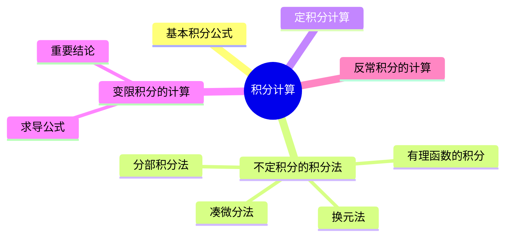

## 基础知识结构

### 1. 基本积分公式

1.  $\int x^{k} dx = \frac{ 1 }{ k+1} x^{k+1} +C,k\ne -1;$
2.  $\int \frac{1}{x} dx=\ln_{}{\left | x \right | } + C$
3.  $\int e^{x} dx=e^{x}+C$
4.  $\int \sin x dx=-\cos x +C$; $\int \cos x dx=\sin x + C$;

    $\int \tan x dx=-\ln_{}{\left | \cos x \right | } + C$; $\int \cot x dx=\ln_{}{\left | \sin x \right | } + C$;
    
    $\int \frac{dx}{\cos x}=\int \sec xdx= \ln \left | \sec x +\tan x \right | + C$;

    $\int \frac{dx}{\sin x}=\int \csc x dx= \ln \left | \csc x - \cot x \right | + C$;

    $\int \sec^{2} xdx=\tan x +C$; $\int \csc^{2} xdx=-\cot x +C$

    $\int \sec x \tan xdx=\sec x +C$; $\int \csc x \cot xdx=-\csc x +C$
5.  $\int \frac{1}{1+x^{2} } dx=\arctan x+C$

    $\int \frac{1}{a^{2}+x^{2} } dx= \frac{1}{a} \arctan \frac {x}{a} +C \left ( a > 0 \right )$
6.  $\int  \frac{1}{\sqrt{1-x^{2}} } dx= \arcsin x +C$

    $\int  \frac{1}{\sqrt{a^{2}-x^{2}} } dx= \arcsin \frac{x}{a} +C \left ( a > 0 \right )$
7.  $\int  \frac{1}{\sqrt{x^{2}+a^{2}} } dx= \ln(x+\sqrt{x^{2}+a^{2}})+C$ (常见a =1)

    $\int  \frac{1}{\sqrt{x^{2}-a^{2}} } dx= \ln\left | x+\sqrt{x^{2}-a^{2}} \right | +C \left ( \left | x \right | > \left | a \right |  \right )$
8.  $\int \dfrac {1}{{x}^{2}-{a}^{2}}dx=\dfrac {1}{2a}\ln \left | \dfrac {x-a}{x+a} \right |+C \left ( \int \dfrac {1}{{a}^{2}-{x}^{2}}dx=\dfrac {1}{2a}\ln \left |\dfrac {x+a}{x-a} \right | +c\right )$
9.  $\int \sqrt {{a}^{2}-{x}^{2}}dx=\dfrac {{a}^{2}}{2}\arcsin \dfrac {x}{a}+\dfrac {x}{2}\sqrt {{a}^{2}-{x}^{2}}+C(a\gt |x|\geqslant 0)$
10. $\int {\sin }^{2}xdx=\dfrac {x}{2}-\dfrac {\sin 2x}{4}+C \left({\sin }^{2}x=\dfrac {1-\cos 2x}{2}\right)$

    $\int {\cos }^{2}xdx=\dfrac {x}{2}+\dfrac {\sin 2x}{4}+C \left ({\cos }^{2}x=\dfrac {1+\cos 2x}{2}\right )$

    $\int {\tan }^{2}xdx=\tan x-x+C\left({\tan }^{2}x={\sec }^{2}x-1 \right )$

    $\int {\cot }^{2}xdx=-\cot x-x+C \left ({\cot }^{2}x={\csc }^{2}x-1\right )$

