# 职工管理系统

## 1、管理系统需求

职工管理系统可以用来管理公司内所有员工的信息

本教程主要利用C++来实现一个基于多态的职工管理系统

公司中职工分为三类：普通员工、经理、老板，显示信息时，需要显示职工编号、职工姓名、职工岗位、以及职责

普通员工职责：完成经理交给的任务

经理职责：完成老板交给的任务，并下发任务给员工

老板职责：管理公司所有事务

管理系统中需要实现的功能如下：

- 退出管理程序：退出当前管理系统
- 增加职工信息：实现批量添加职工功能，将信息录入到文件中，职工信息为：职工编号、姓名、部门编号
- 显示职工信息：显示公司内部所有职工的信息
- 删除离职职工：按照编号删除指定的职工
- 修改职工信息：按照编号修改职工个人信息
- 查找职工信息：按照职工的编号或者职工的姓名进行查找相关的人员信息
- 按照编号排序：按照职工编号，进行排序，排序规则由用户指定
- 清空所有文档：清空文件中记录的所有职工信息 （清空前需要再次确认，防止误删）

系统界面效果图如下：

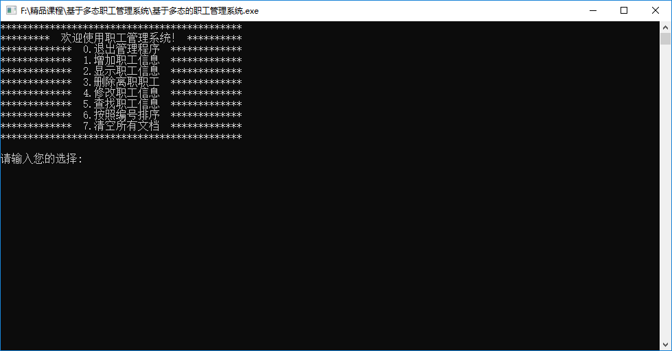

需根据用户不同的选择，完成不同的功能！

## 2、创建项目

创建项目步骤如下：

- 创建新项目
- 添加文件

### 2.1 创建项目

打开vs2017后，点击创建新项目，创建新的C++项目


填写项目名称以及项目路径，点击确定

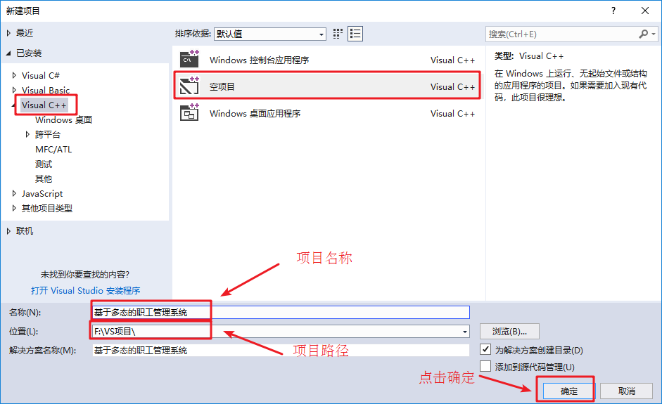

### 2.2 添加文件

右键源文件，进行添加文件操作

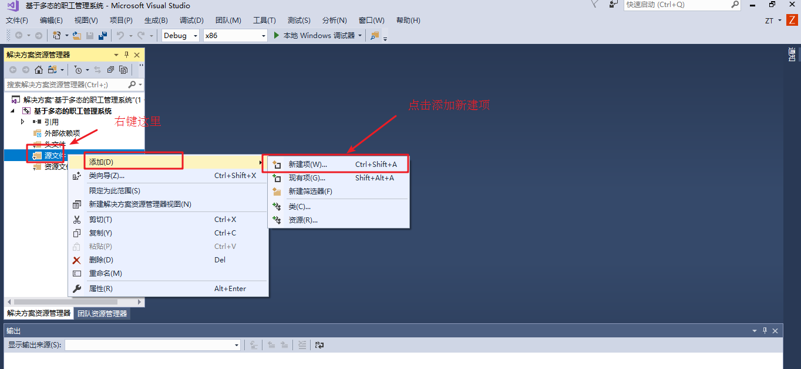

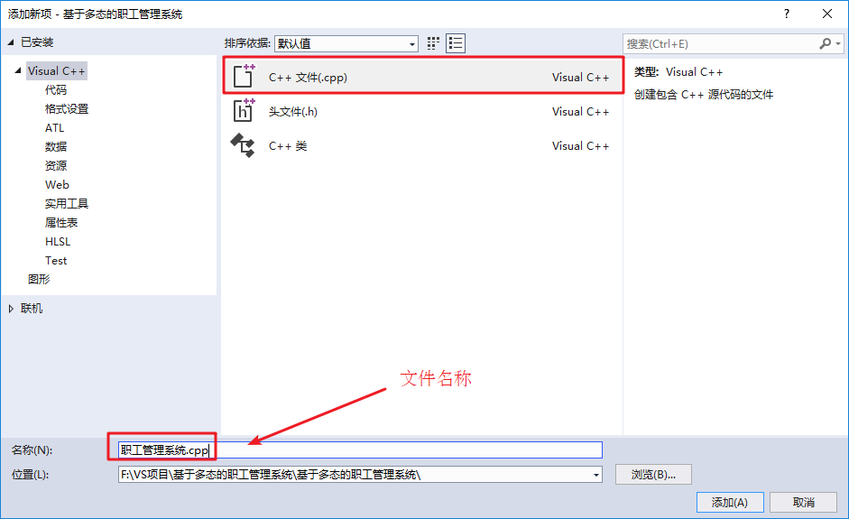

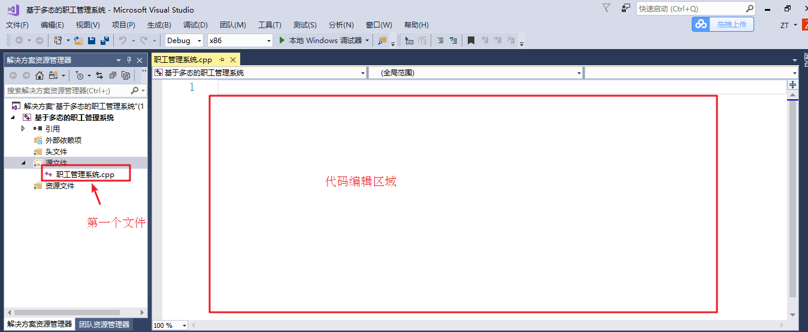

至此，项目已创建完毕

## 3、创建管理类

管理类负责的内容如下：

- 与用户的沟通菜单界面
- 对职工增删改查的操作
- 与文件的读写交互

### 3.1创建文件 

在头文件和源文件的文件夹下分别创建workerManager.h 和 workerManager.cpp文件

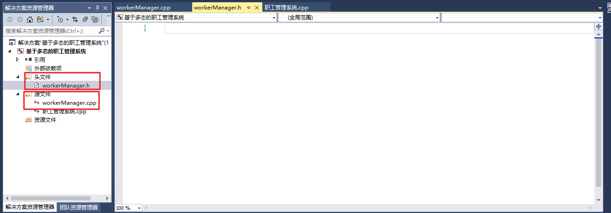

### 3.2 头文件实现

在 workerManager.hpp 中设计管理类

代码如下：

```c++
#pragma once // 确保导入一次
#include<iostream>

class WorkerManager
{
public:

    //构造函数
    WorkerManager();

    //析构函数
    ~WorkerManager();

};
```

### 3.3 源文件实现

在 workerManager.cpp 中将构造和析构函数空实现补全

```c++
#include "workerManager.hpp"

WorkerManager::WorkerManager()
{
}

WorkerManager::~WorkerManager()
{
}
```

至此职工管理类以创建完毕

## 4、菜单功能

功能描述：与用户的沟通界面

### 4.1 添加成员函数

在管理类 workerManager.hpp 中添加成员函数  `void Show_Menu();`

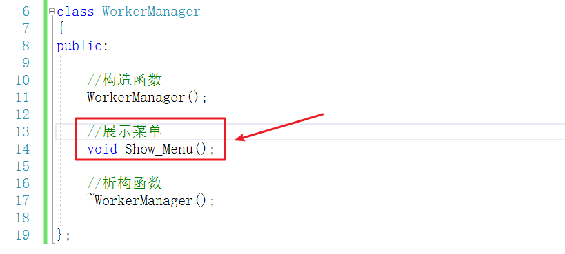

### 4.2 菜单功能实现

在管理类workerManager.cpp中实现  Show_Menu()函数

```c++
void WorkerManager::Show_Menu()
{
    std::cout << "********************************************" << std::endl;
    std::cout << "*********  欢迎使用职工管理系统！ **********" << std::endl;
    std::cout << "*************  0.退出管理程序  *************" << std::endl;
    std::cout << "*************  1.增加职工信息  *************" << std::endl;
    std::cout << "*************  2.显示职工信息  *************" << std::endl;
    std::cout << "*************  3.删除离职职工  *************" << std::endl;
    std::cout << "*************  4.修改职工信息  *************" << std::endl;
    std::cout << "*************  5.查找职工信息  *************" << std::endl;
    std::cout << "*************  6.按照编号排序  *************" << std::endl;
    std::cout << "*************  7.清空所有文档  *************" << std::endl;
    std::cout << "********************************************" << std::endl;
    std::cout << std::endl;
}
```

### 4.3 测试菜单功能

在 职工管理系统.cpp中测试菜单功能

代码：

```c++
#include<iostream>
using namespace std;
#include "workerManager.h"

int main() {

    WorkerManager wm;

    wm.Show_Menu();

    system("pause");

    return 0;
}
```

运行效果如图：

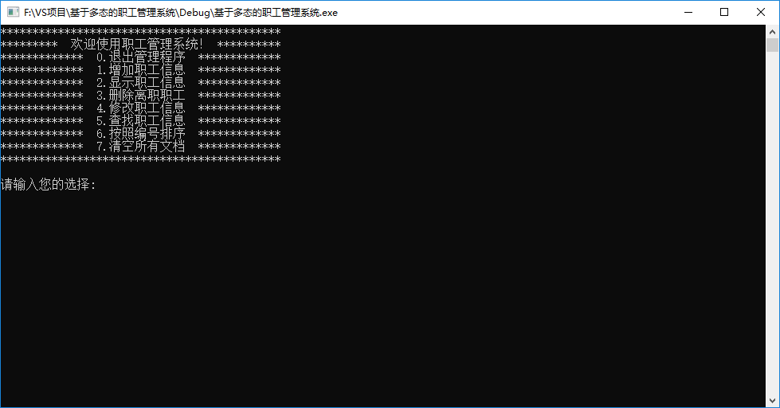

## 5、退出功能

### 5.1  提供功能接口

在main函数中提供分支选择，提供每个功能接口

代码：

```c++
int main() {

    WorkerManager wm;
    int choice = 0;
    while (true)
    {
        //展示菜单
        wm.Show_Menu();
        std::cout << "请输入您的选择:" << std::endl;
        cin >> choice;

        switch (choice)
        {
        case 0: //退出系统
            break;
        case 1: //添加职工
            break;
        case 2: //显示职工
            break;
        case 3: //删除职工
            break;
        case 4: //修改职工
            break;
        case 5: //查找职工
            break;
        case 6: //排序职工
            break;
        case 7: //清空文件
            break;
        default:
            system("cls");
            break;
        }
    }

    system("pause");
    return 0;
}
```

### 5.2 实现退出功能

在workerManager.h中提供退出系统的成员函数 `void ExitSystem();`

在workerManager.cpp中提供具体的功能实现

```c++
void WorkerManager::ExitSystem()
{
    std::cout << "欢迎下次使用" << std::endl;
    system("pause");
    exit(0);
}
```

### 5.3测试功能

在main函数分支 0  选项中，调用退出程序的接口

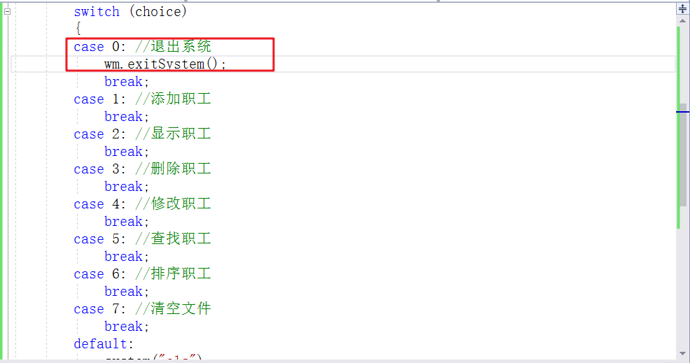

运行测试效果如图：


## 6、创建职工类

### 6.1 创建职工抽象类

职工的分类为：普通员工、经理、老板

将三种职工抽象到一个类（worker）中,利用多态管理不同职工种类

职工的属性为：职工编号、职工姓名、职工所在部门编号

职工的行为为：岗位职责信息描述，获取岗位名称

头文件文件夹下  创建文件 worker.hpp 文件并且添加如下代码：

```c++
#pragma once
#include<iostream>
#include<string>

//职工抽象基类
class Worker
{
public:

    //显示个人信息
    virtual void showInfo() = 0;
    //获取岗位名称
    virtual std::string getDeptName() = 0;

    int m_Id; //职工编号
    std::string m_Name; //职工姓名
    int m_DeptId; //职工所在部门名称编号
};
```

### 6.2 创建普通员工类

普通员工类**继承**职工抽象类，并重写父类中纯虚函数

在头文件和源文件的文件夹下分别创建 employee.hpp 和 employee.cpp文件

employee.hpp 中代码如下：

```c++
#pragma once 
#include<iostream>
#include "worker.hpp"

//员工类
class Employee :public Worker
{
public:

    //构造函数
    Employee(int id, std::string name, int dId);

    //显示个人信息
    virtual void showInfo();

    //获取职工岗位名称
    virtual std::string getDeptName();
};
```

employee.cpp中代码如下：

```c++
#include "employee.hpp"

Employee::Employee(int id, std::string name, int dId)
{
    this->m_Id = id;
    this->m_Name = name;
    this->m_DeptId = dId;
}

void Employee::showInfo()
{
    std::cout << "职工编号： " << this->m_Id
        << " \t职工姓名： " << this->m_Name
        << " \t岗位：" << this->getDeptName()
        << " \t岗位职责：完成经理交给的任务" << std::endl;
}

std::string Employee::getDeptName()
{
    return std::string("员工");
}
```

### 6.3 创建经理类

经理类**继承**职工抽象类，并重写父类中纯虚函数，和普通员工类似

在头文件和源文件的文件夹下分别创建 manager.hpp 和 manager.cpp文件

manager.hpp 中代码如下：

```c++
#pragma once
#include <iostream>
#include "worker.hpp"

//经理类
class Manager :public Worker
{
public:

    Manager(int id, std::string name, int dId);

    //显示个人信息
    virtual void showInfo();

    //获取职工岗位名称
    virtual std::string getDeptName();
};
```

manager.cpp中代码如下：

```c++
#include "manager.hpp"

Manager::Manager(int id, std::string name, int dId)
{
    this->m_Id = id;
    this->m_Name = name;
    this->m_DeptId = dId;

}

void Manager::showInfo()
{
    std::cout << "职工编号： " << this->m_Id
        << " \t职工姓名： " << this->m_Name
        << " \t岗位：" << this->getDeptName()
        << " \t岗位职责：完成老板交给的任务,并下发任务给员工" << std::endl;
}

std::string Manager::getDeptName()
{
    return std::string("经理");
}
```

### 6.4 创建老板类

老板类**继承**职工抽象类，并重写父类中纯虚函数，和普通员工类似

在头文件和源文件的文件夹下分别创建 boss.hpp 和 boss.cpp文件

boss.hpp 中代码如下：

```c++
#pragma once
#include <iostream>
#include "worker.hpp"

//老板类
class Boss :public Worker
{
public:

    Boss(int id, std::string name, int dId);

    //显示个人信息
    virtual void showInfo();

    //获取职工岗位名称
    virtual std::string getDeptName();
};
```

boss.cpp中代码如下：

```c++
#include "boss.hpp"

Boss::Boss(int id, std::string name, int dId)
{
    this->m_Id = id;
    this->m_Name = name;
    this->m_DeptId = dId;
}

void Boss::showInfo()
{
    std::cout << "职工编号： " << this->m_Id
        << " \t职工姓名： " << this->m_Name
        << " \t岗位：" << this->getDeptName()
        << " \t岗位职责：管理公司所有事务" << std::endl;
}

std::string Boss::getDeptName()
{
    return std::string("总裁");
}
```

### 6.5 测试多态

在 职工管理系统.cpp中添加测试函数，并且运行能够产生多态

测试代码如下：

```c++
#include "worker.hpp"
#include "employee.hpp"
#include "manager.hpp"
#include "boss.hpp"

void test()
{
    Worker* worker = NULL;
    worker = new Employee(1, "张三", 1);
    worker->showInfo();
    delete worker;

    worker = new Manager(2, "李四", 2);
    worker->showInfo();
    delete worker;

    worker = new Boss(3, "王五", 3);
    worker->showInfo();
    delete worker;
}
```

运行效果如图：

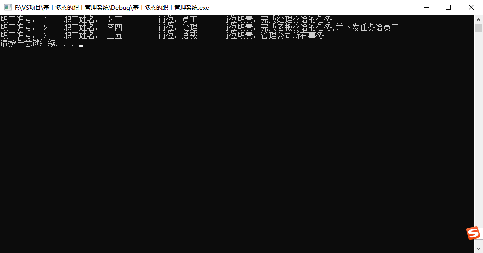

测试成功后，测试代码可以注释保留，或者选择删除

## 7、添加职工

功能描述：批量添加职工，并且保存到文件中

### 7.1 功能分析

分析：

用户在批量创建时，可能会创建不同种类的职工

如果想将所有不同种类的员工都放入到一个数组中，可以将所有员工的指针维护到一个数组里

如果想在程序中维护这个不定长度的数组，可以将数组创建到堆区，并利用 Worker ** 的指针维护

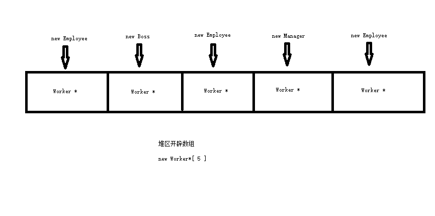

### 7.2 功能实现

在 wokerManager.hpp 头文件中添加成员属性 代码：

```c++
    //记录文件中的人数个数
    int m_EmpNum;

    //员工数组的指针
    Worker** m_EmpArray;
```

在 WorkerManager 构造函数中初始化属性

```c++
WorkerManager::WorkerManager()
{
    //初始化人数
    this->m_EmpNum = 0;

    //初始化数组指针
    this->m_EmpArray = NULL;
}
```

在 workerManager.hpp 中添加成员函数

```c++
    //增加职工
    void Add_Emp();
```

workerManager.cpp 中实现该函数

```c++
//增加职工
void WorkerManager::Add_Emp()
{
    std::cout << "请输入增加职工数量： " << std::endl;

    int addNum = 0;
    std::cin >> addNum;

    if (addNum > 0)
    {
        //计算新空间大小
        int newSize = this->m_EmpNum + addNum;

        //开辟新空间
        Worker** newSpace = new Worker * [newSize];

        //将原空间下内容存放到新空间下
        if (this->m_EmpArray != NULL)
        {
            for (int i = 0; i < this->m_EmpNum; i++)
            {
                newSpace[i] = this->m_EmpArray[i];
            }
        }

        //输入新数据
        for (int i = 0; i < addNum; i++)
        {
            int id;
            std::string name;
            int dSelect;

            std::cout << "请输入第 " << i + 1 << " 个新职工编号：" << std::endl;
            std::cin >> id;


            std::cout << "请输入第 " << i + 1 << " 个新职工姓名：" << std::endl;
            std::cin >> name;


            std::cout << "请选择该职工的岗位：" << std::endl;
            std::cout << "1、普通职工" << std::endl;
            std::cout << "2、经理" << std::endl;
            std::cout << "3、老板" << std::endl;
            std::cin >> dSelect;


            Worker* worker = NULL;
            switch (dSelect)
            {
            case 1: //普通员工
                worker = new Employee(id, name, 1);
                break;
            case 2: //经理
                worker = new Manager(id, name, 2);
                break;
            case 3:  //老板
                worker = new Boss(id, name, 3);
                break;
            default:
                break;
            }


            newSpace[this->m_EmpNum + i] = worker;
        }

        //释放原有空间
        delete[] this->m_EmpArray;

        //更改新空间的指向
        this->m_EmpArray = newSpace;

        //更新新的个数
        this->m_EmpNum = newSize;

        //提示信息
        std::cout << "成功添加" << addNum << "名新职工！" << std::endl;
    }
    else
    {
        std::cout << "输入有误" << std::endl;
    }

    system("pause");
    system("cls");
}
```

在 workerManager.cpp 的析构函数中，释放堆区数据

```c++
WorkerManager::~WorkerManager()
{
    if (this->m_EmpArray != NULL)
    {
        delete[] this->m_EmpArray;
    }
}
```

### 7.3 测试添加

在main函数分支 1  选项中，调用添加职工接口

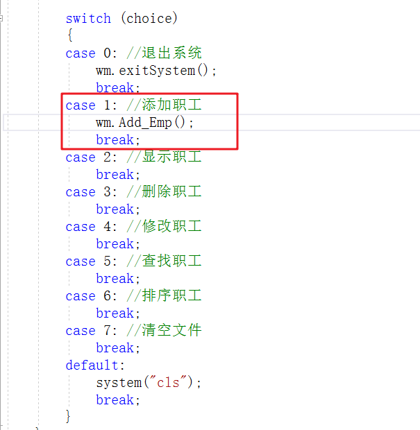

效果如图：

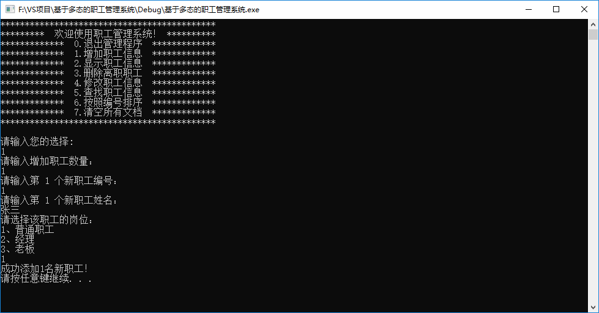

至此，添加职工到程序中功能实现完毕

## 8、文件交互 - 写文件

功能描述：对文件进行读写

在上一个添加功能中，我们只是将所有的数据添加到了内存中，一旦程序结束就无法保存了

​因此文件管理类中需要一个与文件进行交互的功能，对于文件进行读写操作

### 8.1 设定文件路径

首先我们将文件路径，在 workerManager.hpp 中添加宏常量,并且包含头文件 fstream

```c++
#include <fstream>
#define  FILENAME "empFile.txt"
```

### 8.2 成员函数声明

在 workerManager.hpp 中类里添加成员函数 `void save();`

```c++
//保存文件
void save();
```

### 8.3 保存文件功能实现

```c++
void WorkerManager::save()
{
    std::ofstream ofs;
    ofs.open(FILENAME, std::ios::out);


    for (int i = 0; i < this->m_EmpNum; i++)
    {
        ofs << this->m_EmpArray[i]->m_Id << " "
            << this->m_EmpArray[i]->m_Name << " "
            << this->m_EmpArray[i]->m_DeptId << std::endl;
    }

    ofs.close();
}
```

### 8.4 保存文件功能测试

在添加职工功能中添加成功后添加保存文件函数

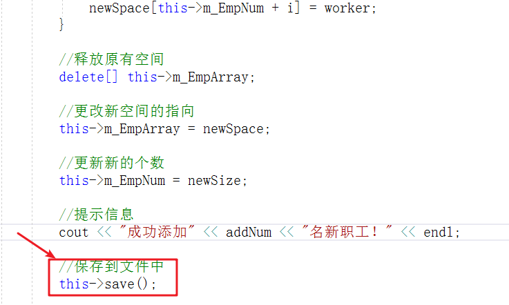

再次运行代码，添加职工


同级目录下多出文件，并且保存了添加的信息

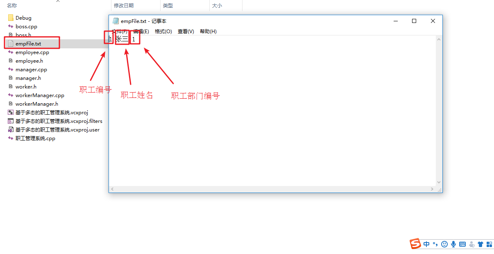

## 9、文件交互 - 读文件

功能描述：将文件中的内容读取到程序中

虽然我们实现了添加职工后保存到文件的操作，但是每次开始运行程序，并没有将文件中数据读取到程序中

而我们的程序功能中还有清空文件的需求

因此构造函数初始化数据的情况分为三种

1. 第一次使用，文件未创建
2. 文件存在，但是数据被用户清空
3. 文件存在，并且保存职工的所有数据

### 9.1 文件未创建

在 workerManager.hpp 中添加新的成员属性 m_FileIsEmpty标志文件是否为空

```c++
    //标志文件是否为空
    bool m_FileIsEmpty;
```

修改 workerManager.cpp 中构造函数代码

```c++
WorkerManager::WorkerManager()
{
    ifstream ifs;
    ifs.open(FILENAME, ios::in);

    //文件不存在情况
    if (!ifs.is_open())
    {
        std::cout << "文件不存在" << std::endl; //测试输出
        this->m_EmpNum = 0;  //初始化人数
        this->m_FileIsEmpty = true; //初始化文件为空标志
        this->m_EmpArray = NULL; //初始化数组
        ifs.close(); //关闭文件
        return;
    }
}
```

删除文件后，测试文件不存在时初始化数据功能

### 9.2 文件存在且数据为空

在 workerManager.cpp 中的构造函数追加代码：

```c++
    //文件存在，并且没有记录
    char ch;
    ifs >> ch;
    if (ifs.eof())
    {
        std::cout << "文件为空!" << std::endl;
        this->m_EmpNum = 0;
        this->m_FileIsEmpty = true;
        this->m_EmpArray = NULL;
        ifs.close();
        return;
    }
```

追加代码位置如图：

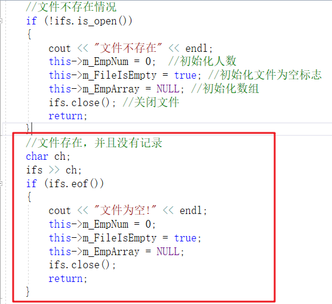

将文件创建后清空文件内容，并测试该情况下初始化功能

我们发现文件不存在或者为空清空 m_FileIsEmpty 判断文件是否为空的标志都为真，那何时为假？

成功添加职工后，应该更改文件不为空的标志

在`void WorkerManager::Add_Emp() `成员函数中添加：

```c++
        //更新职工不为空标志
        this->m_FileIsEmpty = false;
```

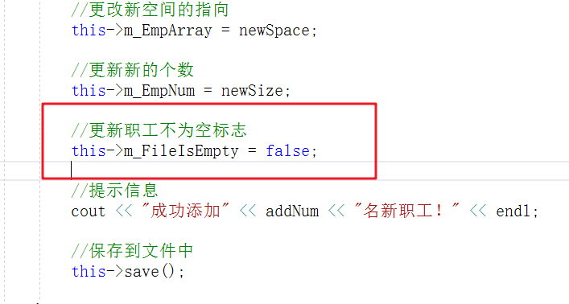

### 9.3 文件存在且保存职工数据

#### 9.3.1 获取记录的职工人数

在 workerManager.hpp 中添加成员函数 ` int get_EmpNum();`

```c++
    //统计人数
    int get_EmpNum();
```

workerManager.cpp 中实现

```c++
int WorkerManager::get_EmpNum()
{
    ifstream ifs;
    ifs.open(FILENAME, ios::in);

    int id;
    std::string name;
    int dId;

    int num = 0;

    while (ifs >> id && ifs >> name && ifs >> dId)
    {
        //记录人数
        num++;
    }
    ifs.close();

    return num;
}
```

在 workerManager.cpp 构造函数中继续追加代码：

```c++
    int num =  this->get_EmpNum();
    std::cout << "职工个数为：" << num << std::endl;  //测试代码
    this->m_EmpNum = num;  //更新成员属性 
```

手动添加一些职工数据，测试获取职工数量函数

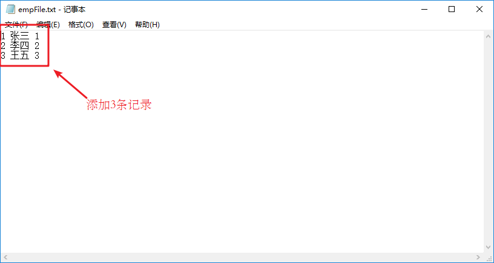

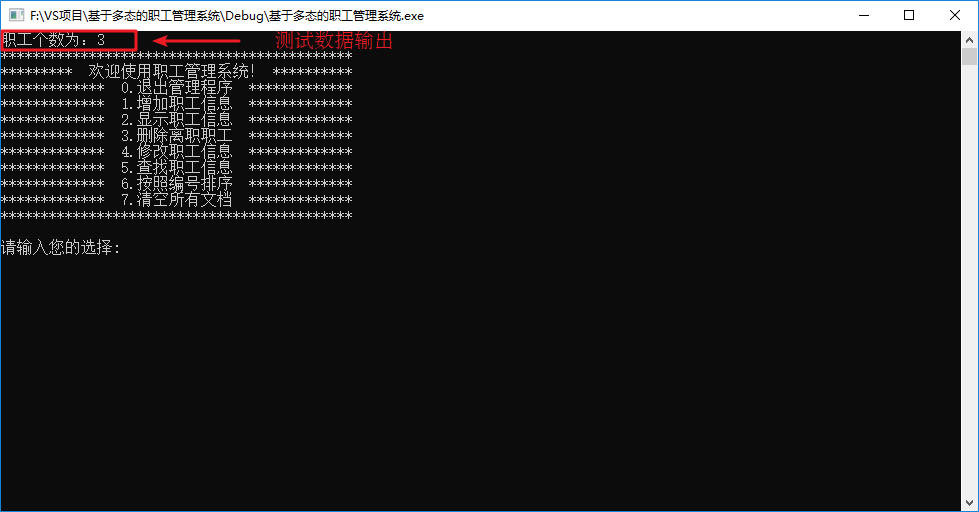

#### 9.3.2 初始化数组

根据职工的数据以及职工数据，初始化workerManager中的Worker ** m_EmpArray 指针

在 workerManager.hpp 中添加成员函数  `void init_Emp();`

```c++
    //初始化员工
    void init_Emp();
```

在 workerManager.cpp 中实现

```c++
void WorkerManager::init_Emp()
{
    std::ifstream ifs;
    ifs.open(FILENAME, std::ios::in);

    int id;
    std::string name;
    int dId;

    int index = 0;
    while (ifs >> id && ifs >> name && ifs >> dId)
    {
        Worker* worker = NULL;
        //根据不同的部门Id创建不同对象
        if (dId == 1)  // 1普通员工
        {
            worker = new Employee(id, name, dId);
        }
        else if (dId == 2) //2经理
        {
            worker = new Manager(id, name, dId);
        }
        else //总裁
        {
            worker = new Boss(id, name, dId);
        }
        //存放在数组中
        this->m_EmpArray[index] = worker;
        index++;
    }
}
```

在 workerManager.cpp 构造函数中追加代码

```c++
    //根据职工数创建数组
    this->m_EmpArray = new Worker *[this->m_EmpNum];
    //初始化职工
    init_Emp();

    //测试代码
    for (int i = 0; i < m_EmpNum; i++)
    {
        std::cout << "职工号： " << this->m_EmpArray[i]->m_Id
            << " 职工姓名： " << this->m_EmpArray[i]->m_Name
            << " 部门编号： " << this->m_EmpArray[i]->m_DeptId << std::endl;
    }
```

运行程序，测试从文件中获取的数据

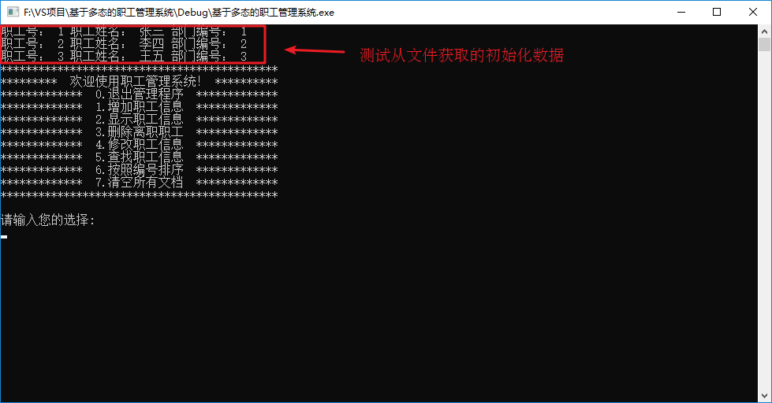

至此初始化数据功能完毕，测试代码可以注释或删除掉！

## 10、显示职工

功能描述：显示当前所有职工信息

#### 10.1 显示职工函数声明

在 workerManager.hpp 中添加成员函数  `void Show_Emp();`

```c++
    //显示职工
    void Show_Emp();
```

#### 10.2 显示职工函数实现

在 workerManager.cpp 中实现成员函数 `void Show_Emp();`

```c++
//显示职工
void WorkerManager::Show_Emp()
{
    if (this->m_FileIsEmpty)
    {
        std::cout << "文件不存在或记录为空！" << std::endl;
    }
    else
    {
        for (int i = 0; i < m_EmpNum; i++)
        {
            //利用多态调用接口
            this->m_EmpArray[i]->showInfo();
        }
    }

    system("pause");
    system("cls");
}
```

#### 10.3 测试显示职工

在main函数分支 2  选项中，调用显示职工接口

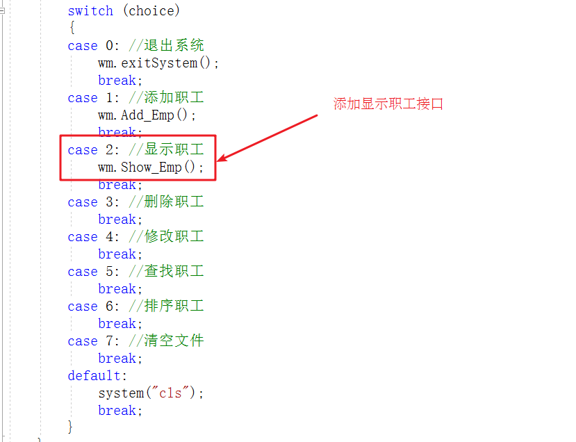

测试时分别测试 文件为空和文件不为空两种情况

测试效果：

测试1-文件不存在或者为空情况

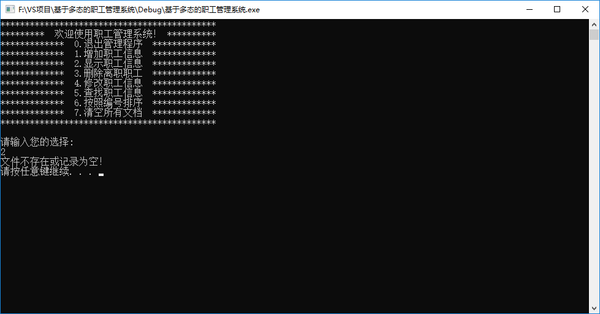

测试2 - 文件存在且有记录情况

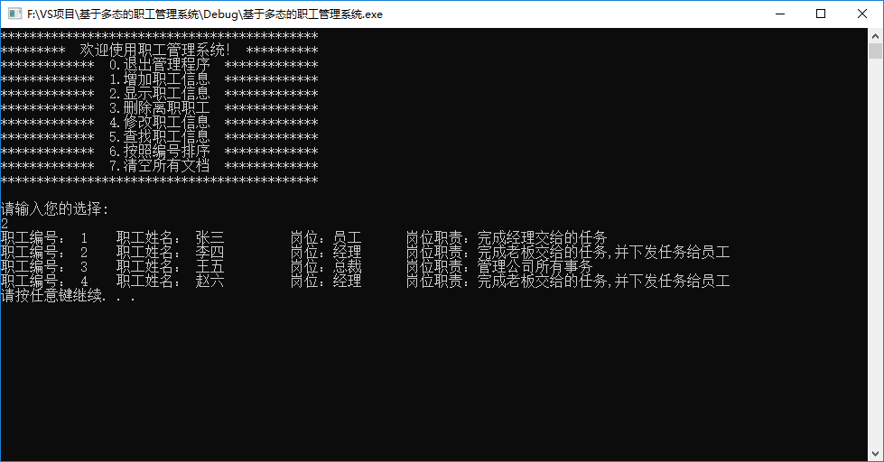

测试完毕，至此，显示所有职工信息功能实现

## 11、删除职工

功能描述：按照职工的编号进行删除职工操作

#### 11.1 删除职工函数声明

在 workerManager.hpp 中添加成员函数  `void Del_Emp();`

```c++
    //删除职工
    void Del_Emp();
```

#### 11.2 职工是否存在函数声明

很多功能都需要用到根据职工是否存在来进行操作如：删除职工、修改职工、查找职工

因此添加该公告函数，以便后续调用

在 workerManager.hpp 中添加成员函数  `int IsExist(int id);`

```c++
    //按照职工编号判断职工是否存在,若存在返回职工在数组中位置，不存在返回-1
    int IsExist(int id);
```

#### 11.3 职工是否存在函数实现

在 workerManager.cpp 中实现成员函数 `int IsExist(int id);`

```c++
int WorkerManager::IsExist(int id)
{
    int index = -1;

    for (int i = 0; i < this->m_EmpNum; i++)
    {
        if (this->m_EmpArray[i]->m_Id == id)
        {
            index = i;

            break;
        }
    }

    return index;
}
```

#### 11.4 删除职工函数实现

在workerManager.cpp中实现成员函数 ` void Del_Emp();`

```c++
//删除职工
void WorkerManager::Del_Emp()
{
    if (this->m_FileIsEmpty)
    {
        std::cout << "文件不存在或记录为空！" << std::endl;
    }
    else
    {
        //按职工编号删除
        std::cout << "请输入想要删除的职工号：" << std::endl;
        int id = 0;
        std::cin >> id;

        int index = this->IsExist(id);

        if (index != -1)  //说明index上位置数据需要删除
        {
            for (int i = index; i < this->m_EmpNum - 1; i++)
            {
                this->m_EmpArray[i] = this->m_EmpArray[i + 1];
            }
            this->m_EmpNum--;

            this->save(); //删除后数据同步到文件中
            std::cout << "删除成功！" << std::endl;
        }
        else
        {
            std::cout << "删除失败，未找到该职工" << std::endl;
        }
    }
    
    system("pause");
    system("cls");
}
```

#### 11.5 测试删除职工

在main函数分支 3  选项中，调用删除职工接口

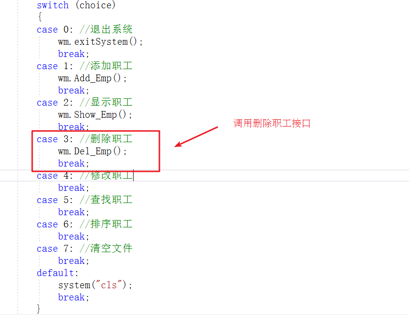

测试1 - 删除不存在职工情况

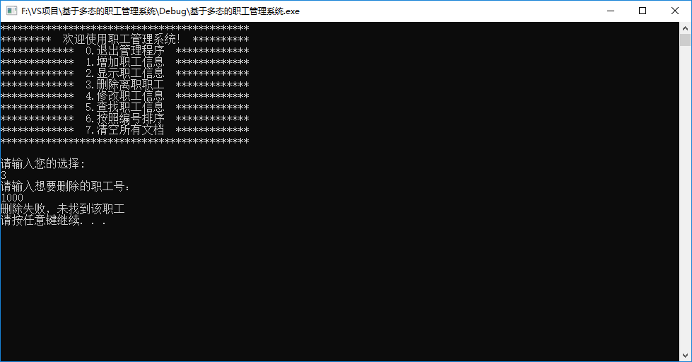

测试2 - 删除存在的职工情况

删除成功提示图：

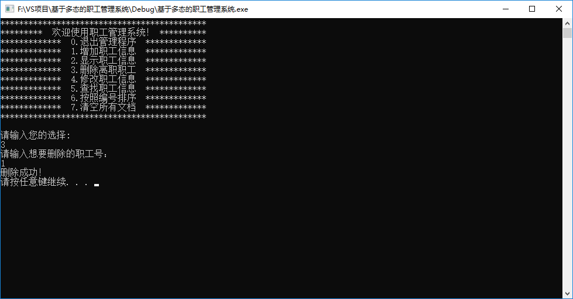

再次显示所有职工信息，确保已经删除

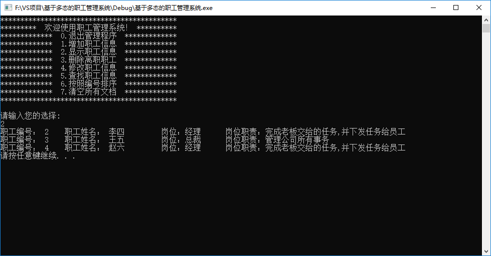

查看文件中信息，再次核实员工已被完全删除

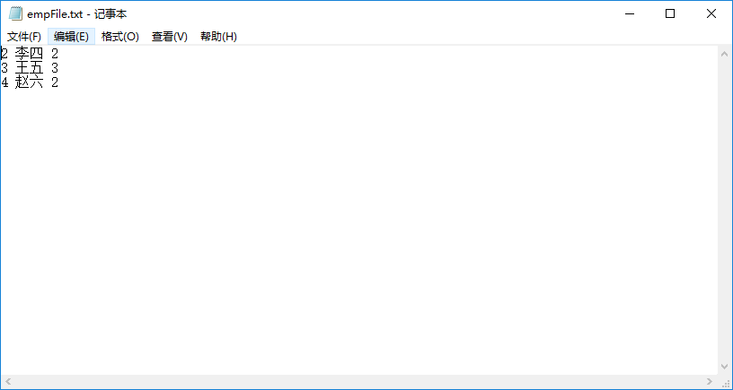

至此，删除职工功能实现完毕！

## 12、修改职工

功能描述：能够按照职工的编号对职工信息进行修改并保存

#### 12.1 修改职工函数声明

在 workerManager.hpp 中添加成员函数  `void Mod_Emp();`

```c++
    //修改职工
    void Mod_Emp();
```

#### 12.2 修改职工函数实现

在 workerManager.cpp 中实现成员函数 ` void Mod_Emp();`

```c++
//修改职工
void WorkerManager::Mod_Emp()
{
    if (this->m_FileIsEmpty)
    {
        std::cout << "文件不存在或记录为空！" << std::endl;
    }
    else
    {
        std::cout << "请输入修改职工的编号：" << std::endl;
        int id;
        std::cin >> id;

        int ret = this->IsExist(id);
        if (ret != -1)
        {
            //查找到编号的职工

            delete this->m_EmpArray[ret];

            int newId = 0;
            std::string newName = "";
            int dSelect = 0;

            std::cout << "查到： " << id << "号职工，请输入新职工号： " << std::endl;
            std::cin >> newId;

            std::cout << "请输入新姓名： " << std::endl;
            std::cin >> newName;

            std::cout << "请输入岗位： " << std::endl;
            std::cout << "1、普通职工" << std::endl;
            std::cout << "2、经理" << std::endl;
            std::cout << "3、老板" << std::endl;
            std::cin >> dSelect;

            Worker* worker = NULL;
            switch (dSelect)
            {
            case 1:
                worker = new Employee(newId, newName, dSelect);
                break;
            case 2:
                worker = new Manager(newId, newName, dSelect);
                break;
            case 3:
                worker = new Boss(newId, newName, dSelect);
                break;
            default:
                break;
            }

            //更改数据 到数组中
            this->m_EmpArray[ret] = worker;

            std::cout << "修改成功！" << std::endl;

            //保存到文件中
            this->save();
        }
        else
        {
            std::cout << "修改失败，查无此人" << std::endl;
        }
    }

    //按任意键 清屏
    system("pause");
    system("cls");
}
```

#### 12.3 测试修改职工

在main函数分支 4  选项中，调用修改职工接口

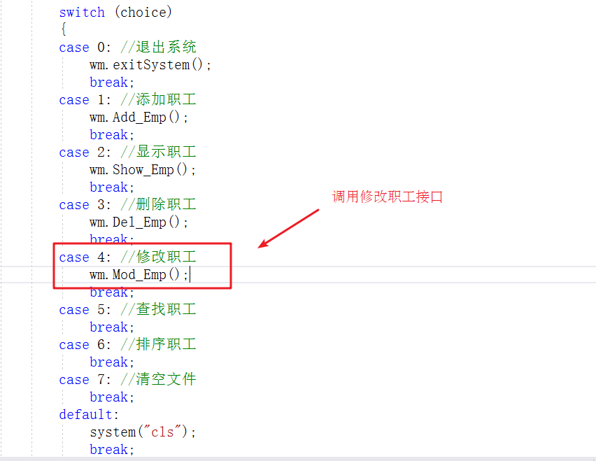

测试1 - 修改不存在职工情况

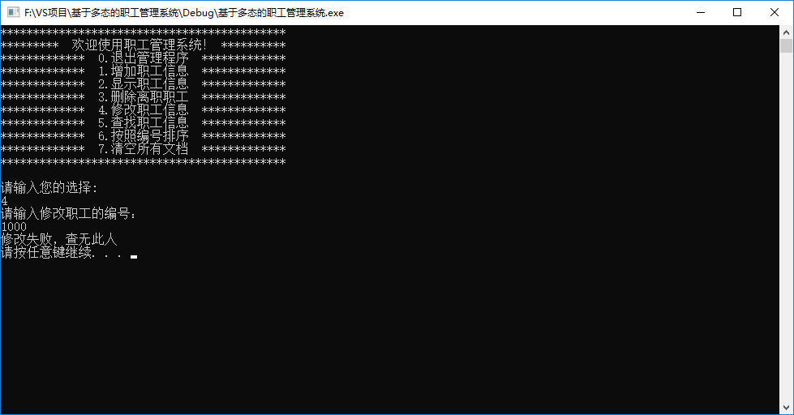

测试2 - 修改存在职工情况，例如将职工 "李四" 改为 "赵四"

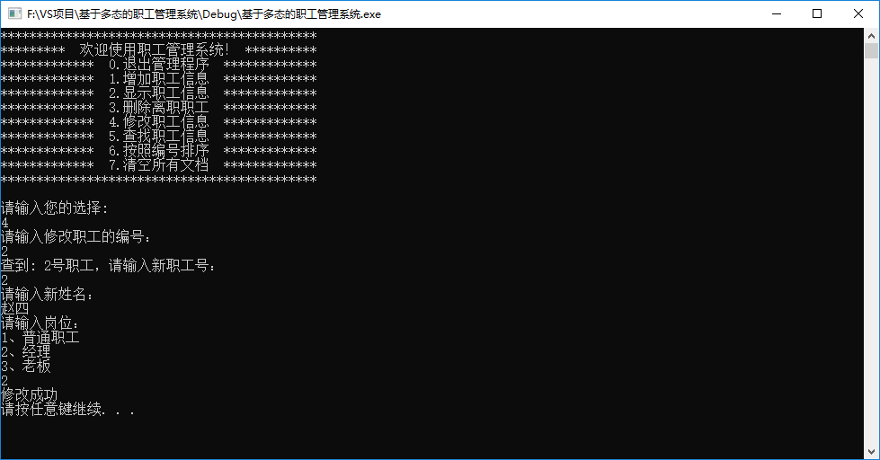

修改后再次查看所有职工信息，并确认修改成功


再次确认文件中信息也同步更新


至此，修改职工功能已实现！

## 13、查找职工

功能描述：提供两种查找职工方式，一种按照职工编号，一种按照职工姓名

#### 13.1 查找职工函数声明

在workerManager.h中添加成员函数  `void Find_Emp();`

```c++
    //查找职工
    void Find_Emp();
```

#### 13.2 查找职工函数实现

在 workerManager.cpp 中实现成员函数 ` void Find_Emp();`

```c++
//查找职工
void WorkerManager::Find_Emp()
{
    if (this->m_FileIsEmpty)
    {
        std::cout << "文件不存在或记录为空！" << std::endl;
    }
    else
    {
        std::cout << "请输入查找的方式：" << std::endl;
        std::cout << "1、按职工编号查找" << std::endl;
        std::cout << "2、按姓名查找" << std::endl;

        int select = 0;
        std::cin >> select;


        if (select == 1) //按职工号查找
        {
            int id;
            std::cout << "请输入查找的职工编号：" << std::endl;
            std::cin >> id;

            int ret = IsExist(id);
            if (ret != -1)
            {
                std::cout << "查找成功！该职工信息如下：" << std::endl;
                this->m_EmpArray[ret]->showInfo();
            }
            else
            {
                std::cout << "查找失败，查无此人" << std::endl;
            }
        }
        else if (select == 2) //按姓名查找
        {
            std::string name;
            std::cout << "请输入查找的姓名：" << std::endl;
            std::cin >> name;

            bool flag = false;  //查找到的标志
            for (int i = 0; i < m_EmpNum; i++)
            {
                if (m_EmpArray[i]->m_Name == name)
                {
                    std::cout << "查找成功,职工编号为："
                        << m_EmpArray[i]->m_Id
                        << " 号的信息如下：" << std::endl;

                    flag = true;

                    this->m_EmpArray[i]->showInfo();
                }
            }
            if (flag == false)
            {
                //查无此人
                std::cout << "查找失败，查无此人" << std::endl;
            }
        }
        else
        {
            std::cout << "输入选项有误" << std::endl;
        }
    }

    system("pause");
    system("cls");
}
```

#### 13.3 测试查找职工

在main函数分支 5  选项中，调用查找职工接口

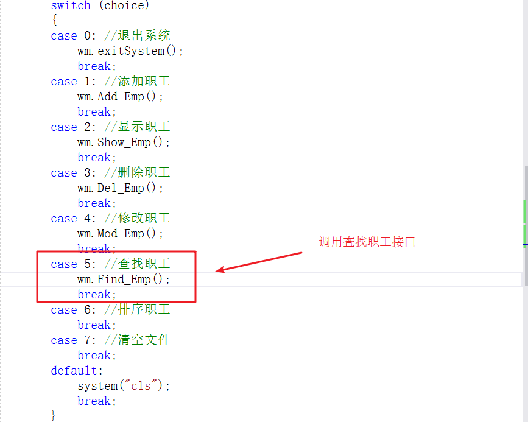

测试1 - 按照职工编号查找 - 查找不存在职工

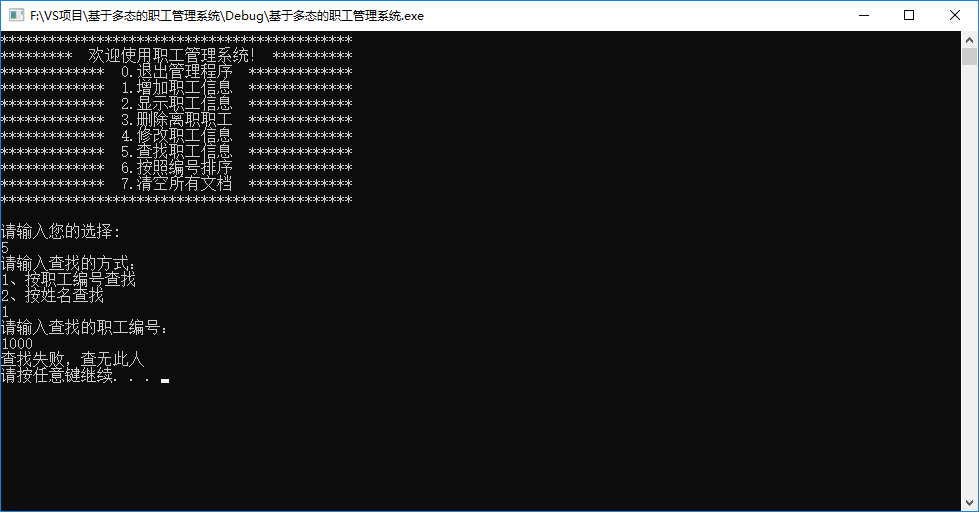

测试2 - 按照职工编号查找 -  查找存在职工

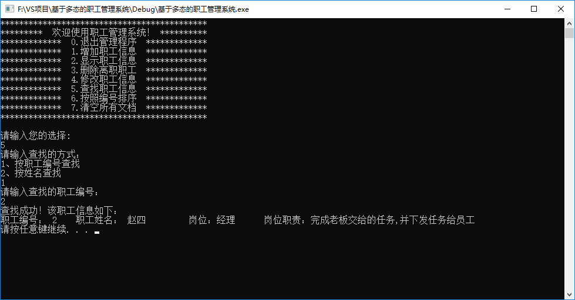

测试3 - 按照职工姓名查找 - 查找不存在职工


测试4 - 按照职工姓名查找 - 查找存在职工（如果出现重名，也一并显示，在文件中可以添加重名职工）

例如 添加两个王五的职工，然后按照姓名查找王五

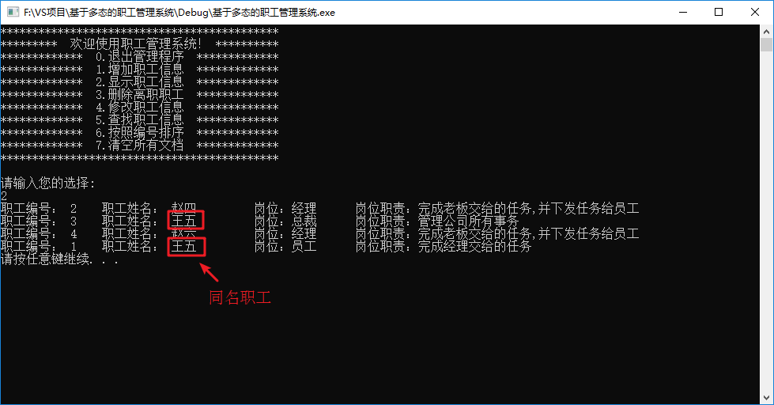

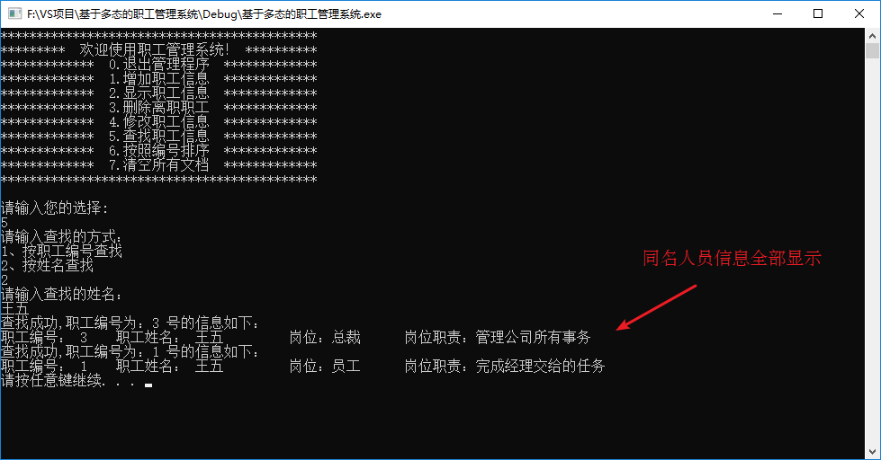

至此，查找职工功能实现完毕！

## 14、排序

功能描述：按照职工编号进行排序，排序的顺序由用户指定

#### 14.1 排序函数声明

在 workerManager.hpp 中添加成员函数  `void Sort_Emp();`

```c++
    //排序职工
    void Sort_Emp();
```

#### 14.2 排序函数实现

在 workerManager.cpp 中实现成员函数 ` void Sort_Emp();`

```c++
//排序职工
void WorkerManager::Sort_Emp()
{
    if (this->m_FileIsEmpty)
    {
        std::cout << "文件不存在或记录为空！" << std::endl;
        system("pause");
        system("cls");
    }
    else
    {
        std::cout << "请选择排序方式： " << std::endl;
        std::cout << "1、按职工号进行升序" << std::endl;
        std::cout << "2、按职工号进行降序" << std::endl;

        int select = 0;
        std::cin >> select;


        for (int i = 0; i < m_EmpNum; i++)
        {
            int minOrMax = i;
            for (int j = i + 1; j < m_EmpNum; j++)
            {
                if (select == 1) //升序
                {
                    if (m_EmpArray[minOrMax]->m_Id > m_EmpArray[j]->m_Id)
                    {
                        minOrMax = j;
                    }
                }
                else  //降序
                {
                    if (m_EmpArray[minOrMax]->m_Id < m_EmpArray[j]->m_Id)
                    {
                        minOrMax = j;
                    }
                }
            }

            if (i != minOrMax)
            {
                Worker* temp = m_EmpArray[i];
                m_EmpArray[i] = m_EmpArray[minOrMax];
                m_EmpArray[minOrMax] = temp;
            }

        }

        std::cout << "排序成功,排序后结果为：" << std::endl;
        this->save();
        this->Show_Emp();
    }
}
```

#### 14.3 测试排序功能

在main函数分支 6  选项中，调用排序职工接口

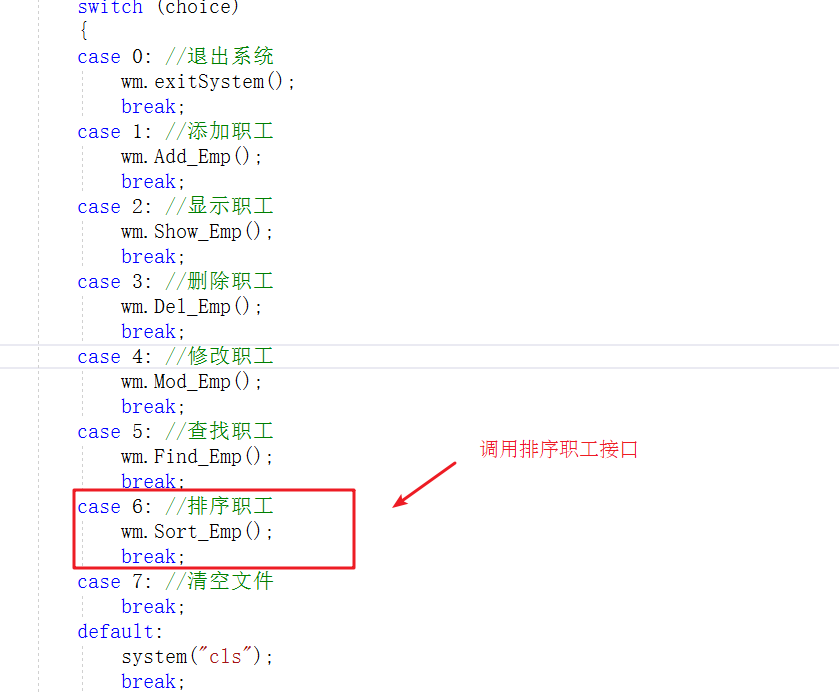

测试：

首先我们添加一些职工，序号是无序的，例如：

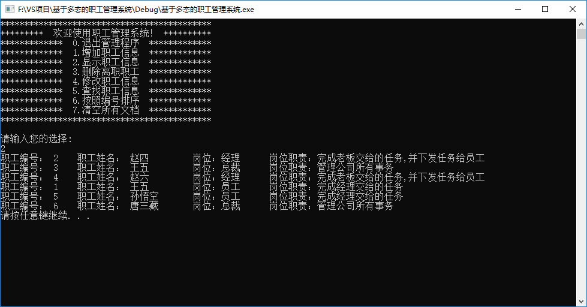

测试 - 升序排序

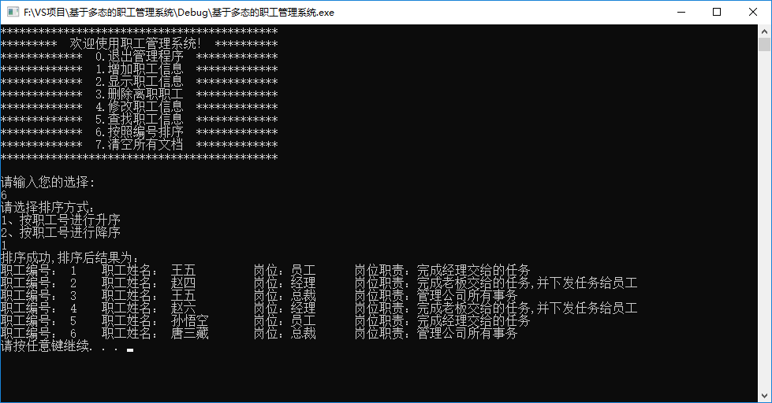

文件同步更新

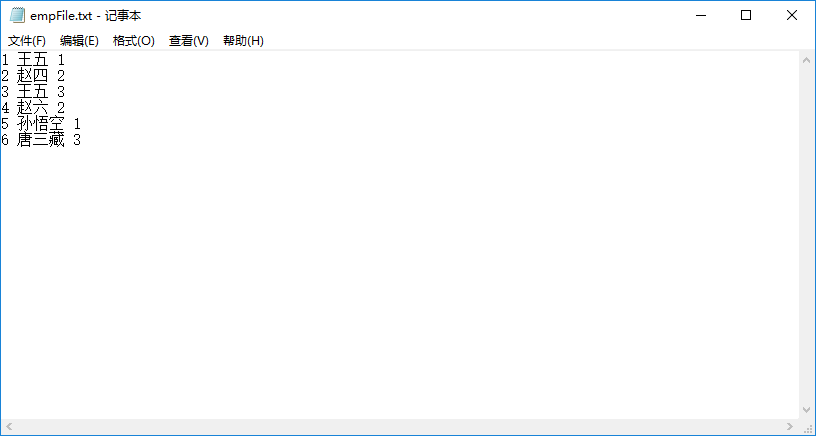

测试 - 降序排序

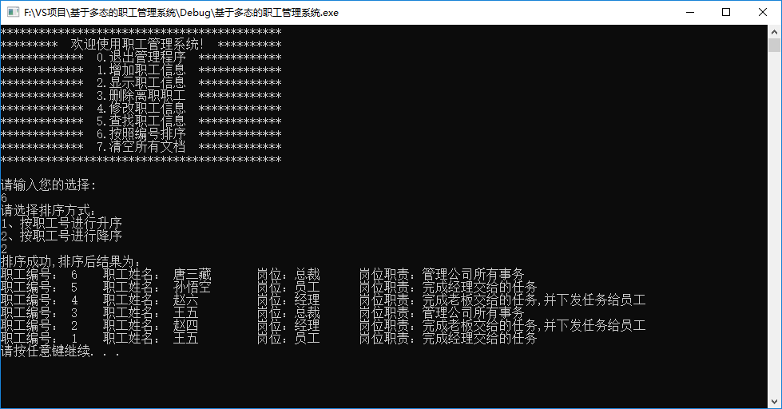

文件同步更新

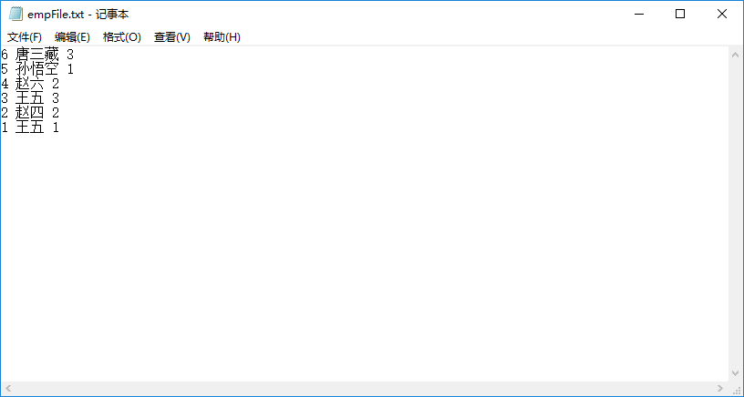

至此，职工按照编号排序的功能实现完毕！

## 15、清空文件

功能描述：将文件中记录数据清空

#### 15.1 清空函数声明

在 workerManager.hpp 中添加成员函数  `void Clean_File();`

```c++
    //清空文件
    void Clean_File();
```

#### 15.2 清空函数实现

在 workerManager.cpp 中实现员函数 ` void Clean_File();`

```c++
//清空文件
void WorkerManager::Clean_File()
{
    std::cout << "确认清空？" << std::endl;
    std::cout << "1、确认" << std::endl;
    std::cout << "2、返回" << std::endl;

    int select = 0;
    std::cin >> select;

    if (select == 1)
    {
        //打开模式 ios::trunc 如果存在删除文件并重新创建
        std::ofstream ofs(FILENAME, std::ios::trunc);
        ofs.close();

        if (this->m_EmpArray != NULL)
        {
            for (int i = 0; i < this->m_EmpNum; i++)
            {
                if (this->m_EmpArray[i] != NULL)
                {
                    delete this->m_EmpArray[i];
                }
            }
            this->m_EmpNum = 0;
            delete[] this->m_EmpArray;
            this->m_EmpArray = NULL;
            this->m_FileIsEmpty = true;
        }
        std::cout << "清空成功！" << std::endl;
    }

    system("pause");
    system("cls");
}
```

#### 15.3 测试清空文件

在main函数分支 7  选项中，调用清空文件接口

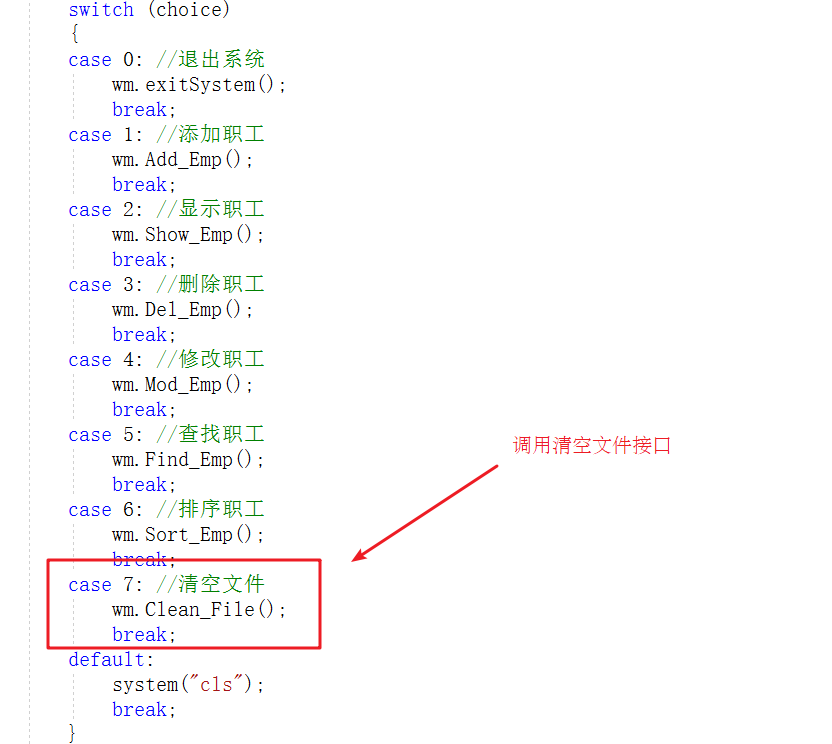

测试：确认清空文件

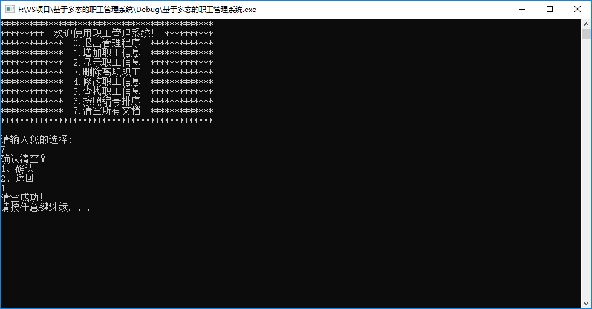

再次查看文件中数据，记录已为空


打开文件，里面数据已确保清空，该功能需要慎用！

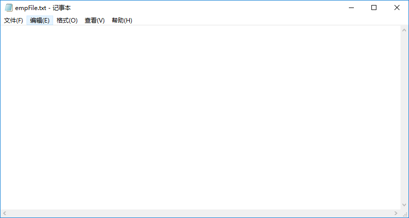

随着清空文件功能实现，本案例制作完毕  ^ _ ^  
