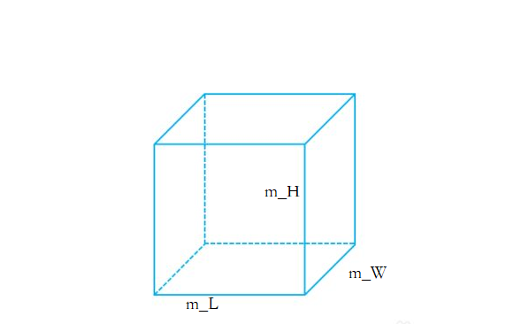
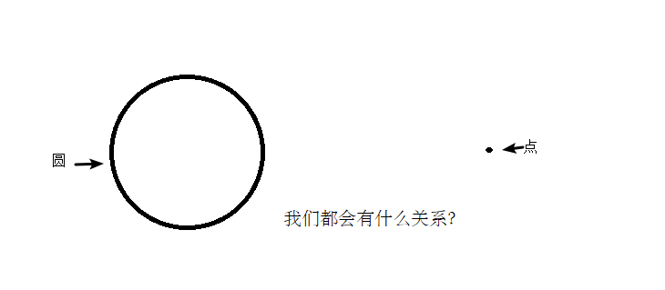

## **4** 类和对象

C++面向对象的三大特性为：`封装、继承、多态`

C++认为`万事万物都皆为对象`，对象上有其属性和行为

**例如** :

​	人可以作为对象，属性有姓名、年龄、身高、体重...，行为有走、跑、跳、吃饭、唱歌...

​	车也可以作为对象，属性有轮胎、方向盘、车灯...,行为有载人、放音乐、放空调...

​	具有相同性质的`对象`，我们可以抽象称为`类`，人属于人类，车属于车类

### 4.1 封装

#### 4.1.1  封装的意义

封装是C++面向对象三大特性之一

封装的意义：

- 将属性和行为作为一个整体，表现生活中的事物
- 将属性和行为加以权限控制

**封装意义一** :

​	在设计类的时候，属性和行为写在一起，表现事物

**语法** : `class 类名{   访问权限： 属性  / 行为  };`

**示例1** :设计一个圆类，求圆的周长

**示例代码** :

```c++
#include<iostream>

//圆周率
const double PI = 3.14;

//1、封装的意义
//将属性和行为作为一个整体，用来表现生活中的事物

//封装一个圆类，求圆的周长
//class代表设计一个类，后面跟着的是类名
class Circle1
{
public:  //访问权限  公共的权限

	//属性
	int m_r;//半径

	//行为
	//获取到圆的周长
	double calculateZC()
	{
		//2 * pi  * r
		//获取圆的周长
		return  2 * PI * m_r;
	}
};

int main() {

	//通过圆类，创建圆的对象
	// c1就是一个具体的圆
	Circle1 c1;
	c1.m_r = 10; //给圆对象的半径 进行赋值操作

	//2 * pi * 10 = = 62.8
	std::cout << "圆的周长为： " << c1.calculateZC() << std::endl;

	return 0;
}
```

**示例2** :设计一个学生类，属性有姓名和学号，可以给姓名和学号赋值，可以显示学生的姓名和学号

**示例2代码** :

```c++
#include<iostream>
#include<string>

//学生类
class Student2 {
public:
    void setName(std::string name) {
        m_name = name;
    }
    void setID(int id) {
        m_id = id;
    }

    void showStudent() {
        std::cout << "name:" << m_name << " ID:" << m_id << std::endl;
    }
public:
    std::string m_name;
    int m_id;
};

int main() {

    Student2 stu;
    stu.setName("德玛西亚");
    stu.setID(250);
    stu.showStudent();

    return 0;
}
```

**封装意义二** :

类在设计时，可以把属性和行为放在不同的权限下，加以控制

访问权限有三种：

1. public        公共权限  
2. protected 保护权限
3. private      私有权限

**示例** :

```c++
#include<iostream>
#include<string>

//三种权限
//公共权限  public     类内可以访问  类外可以访问
//保护权限  protected  类内可以访问  类外不可以访问
//私有权限  private    类内可以访问  类外不可以访问

class Person3
{
    //姓名  公共权限
public:
    std::string m_Name;

    //汽车  保护权限
protected:
    std::string m_Car;

    //银行卡密码  私有权限
private:
    int m_Password;

public:
    void func()
    {
        m_Name = "张三";
        m_Car = "拖拉机";
        m_Password = 123456;
    }
};

int main() {

    Person3 p;
    p.m_Name = "李四";
    //p.m_Car = "奔驰";  //保护权限类外访问不到
    //p.m_Password = 123; //私有权限类外访问不到

    return 0;
}
```

#### 4.1.2 struct和class区别

在C++中 struct和class唯一的**区别**就在于 **默认的访问权限不同**

区别：

- struct 默认权限为公共
- class   默认权限为私有

```c++
#include<iostream>

class C41
{
    int  m_A; //默认是私有权限
};

struct C42
{
    int m_A;  //默认是公共权限
};

int main() {

    C41 c1;
    //c1.m_A = 10; //错误，访问权限是私有

    C42 c2;
    c2.m_A = 10; //正确，访问权限是公共

    return 0;
}
```

#### 4.1.3 成员属性设置为私有

**优点1** :将所有成员属性设置为私有，可以自己控制读写权限

**优点2** :对于写权限，我们可以检测数据的有效性

**示例** :

```c++
#include<iostream>
#include<string>

class Person5 {
public:

    //姓名设置可读可写
    void setName(std::string name) {
        m_Name = name;
    }
    std::string getName()
    {
        return m_Name;
    }

    //获取年龄 
    int getAge() {
        return m_Age;
    }
    //设置年龄
    void setAge(int age) {
        if (age < 0 || age > 150) {
            std::cout << "你个老妖精!" << std::endl;
            return;
        }
        m_Age = age;
    }

    //情人设置为只写
    void setLover(std::string lover) {
        m_Lover = lover;
    }

private:
    std::string m_Name;     //可读可写  姓名
    int m_Age;              //只读  年龄
    std::string m_Lover;    //只写  情人
};


int main() {

    Person5 p;
    //姓名设置
    p.setName("张三");
    std::cout << "姓名： " << p.getName() << std::endl;

    //年龄设置
    p.setAge(50);
    std::cout << "年龄： " << p.getAge() << std::endl;

    //情人设置
    p.setLover("苍井");
    //std::cout << "情人： " << p.m_Lover << std::endl;  //只写属性，不可以读取

    return 0;
}
```

**练习案例1：设计立方体类**

设计立方体类(Cube)

求出立方体的面积和体积

分别用全局函数和成员函数判断两个立方体是否相等。



**练习案例2：点和圆的关系**

设计一个圆形类（Circle），和一个点类（Point），计算点和圆的关系。


