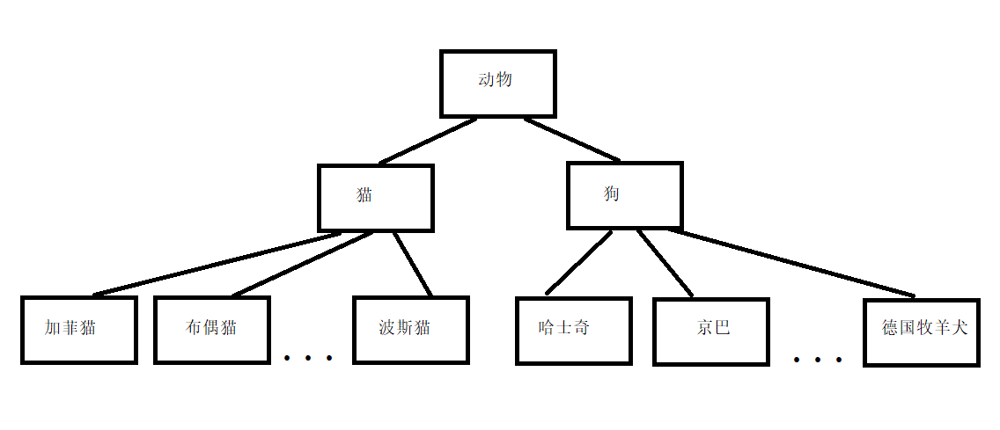
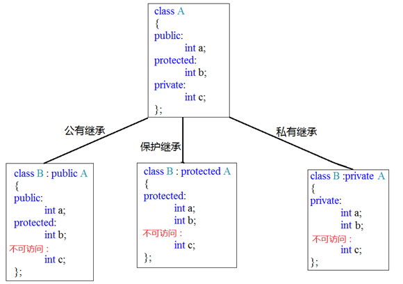
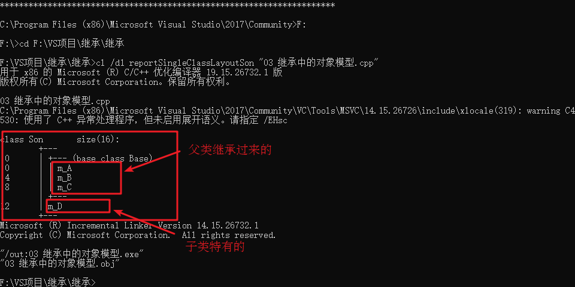
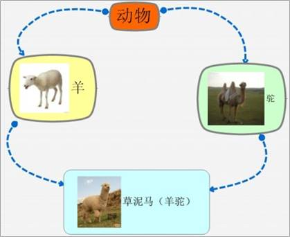

### 4.6 继承

**继承是面向对象三大特性之一**

有些类与类之间存在特殊的关系，例如下图中：



我们发现，定义这些类时，下级别的成员除了拥有上一级的共性，还有自己的特性。

这个时候我们就可以考虑利用继承的技术，减少重复代码

#### 4.6.1 继承的基本语法

例如我们看到很多网站中，都有公共的头部，公共的底部，甚至公共的左侧列表，只有中心内容不同

接下来我们分别利用普通写法和继承的写法来实现网页中的内容，看一下继承存在的意义以及好处

**普通实现** ：

```c++
#include<iostream>

//Java页面
class Java
{
public:
    void header()
    {
        std::cout << "首页、公开课、登录、注册...（公共头部）" << std::endl;
    }
    void footer()
    {
        std::cout << "帮助中心、交流合作、站内地图...(公共底部)" << std::endl;
    }
    void left()
    {
        std::cout << "Java,Python,C++...(公共分类列表)" << std::endl;
    }
    void content()
    {
        std::cout << "JAVA学科视频" << std::endl;
    }
};
//Python页面
class Python
{
public:
    void header()
    {
        std::cout << "首页、公开课、登录、注册...（公共头部）" << std::endl;
    }
    void footer()
    {
        std::cout << "帮助中心、交流合作、站内地图...(公共底部)" << std::endl;
    }
    void left()
    {
        std::cout << "Java,Python,C++...(公共分类列表)" << std::endl;
    }
    void content()
    {
        std::cout << "Python学科视频" << std::endl;
    }
};
//C++页面
class CPP
{
public:
    void header()
    {
        std::cout << "首页、公开课、登录、注册...（公共头部）" << std::endl;
    }
    void footer()
    {
        std::cout << "帮助中心、交流合作、站内地图...(公共底部)" << std::endl;
    }
    void left()
    {
        std::cout << "Java,Python,C++...(公共分类列表)" << std::endl;
    }
    void content()
    {
        std::cout << "C++学科视频" << std::endl;
    }
};

void test1()
{
    //Java页面
    std::cout << "Java下载视频页面如下： " << std::endl;
    Java ja;
    ja.header();
    ja.footer();
    ja.left();
    ja.content();
    std::cout << "--------------------" << std::endl;

    //Python页面
    std::cout << "Python下载视频页面如下： " << std::endl;
    Python py;
    py.header();
    py.footer();
    py.left();
    py.content();
    std::cout << "--------------------" << std::endl;

    //C++页面
    std::cout << "C++下载视频页面如下： " << std::endl;
    CPP cp;
    cp.header();
    cp.footer();
    cp.left();
    cp.content();

}

int main() {

    test1();

    return 0;
}
```

**继承实现** ：

```c++
#include<iostream>

//公共页面
class BasePage
{
public:
    void header()
    {
        std::cout << "首页、公开课、登录、注册...（公共头部）" << std::endl;
    }

    void footer()
    {
        std::cout << "帮助中心、交流合作、站内地图...(公共底部)" << std::endl;
    }
    void left()
    {
        std::cout << "Java,Python,C++...(公共分类列表)" << std::endl;
    }

};

//Java页面
class Java : public BasePage
{
public:
    void content()
    {
        std::cout << "JAVA学科视频" << std::endl;
    }
};
//Python页面
class Python : public BasePage
{
public:
    void content()
    {
        std::cout << "Python学科视频" << std::endl;
    }
};
//C++页面
class CPP : public BasePage
{
public:
    void content()
    {
        std::cout << "C++学科视频" << std::endl;
    }
};

void test1()
{
    //Java页面
    std::cout << "Java下载视频页面如下： " << std::endl;
    Java ja;
    ja.header();
    ja.footer();
    ja.left();
    ja.content();
    std::cout << "--------------------" << std::endl;

    //Python页面
    std::cout << "Python下载视频页面如下： " << std::endl;
    Python py;
    py.header();
    py.footer();
    py.left();
    py.content();
    std::cout << "--------------------" << std::endl;

    //C++页面
    std::cout << "C++下载视频页面如下： " << std::endl;
    CPP cp;
    cp.header();
    cp.footer();
    cp.left();
    cp.content();

}

int main() {

    test1();

    return 0;
}
```

**总结** ：

继承的好处：**可以减少重复的代码**

class A : public B; 

A 类称为子类 或 派生类

B 类称为父类 或 基类

**派生类中的成员，包含两大部分**：

一类是从基类继承过来的，一类是自己增加的成员。

从基类继承过过来的表现其共性，而新增的成员体现了其个性。

#### 4.6.2 继承方式

继承的语法：`class 子类 : 继承方式  父类`

**继承方式一共有三种** ：

- 公共继承
- 保护继承
- 私有继承



**示例** ：

```c++
#include<iostream>

class Base31
{
public:
    int m_A;
protected:
    int m_B;
private:
    int m_C;
};

//公共继承
class Son31 :public Base31
{
public:
    void func()
    {
        m_A; //可访问 public权限
        m_B; //可访问 protected权限
        //m_C; //不可访问
    }
};

void myClass()
{
    Son31 s1;
    s1.m_A; //其他类只能访问到公共权限
}

//保护继承
class Base32
{
public:
    int m_A;
protected:
    int m_B;
private:
    int m_C;
};

class Son2 :protected Base32
{
public:
    void func()
    {
        m_A; //可访问 protected权限
        m_B; //可访问 protected权限
        //m_C; //不可访问
    }
};
void myClass2()
{
    Son2 s;
    //s.m_A; //不可访问
}

//私有继承
class Base33
{
public:
    int m_A;
protected:
    int m_B;
private:
    int m_C;
};

class Son33 :private Base33
{
public:
    void func()
    {
        m_A; //可访问 private权限
        m_B; //可访问 private权限
        //m_C; //不可访问
    }
};

class GrandSon33 :public Son33
{
public:
    void func()
    {
        //Son3是私有继承，所以继承Son3的属性在GrandSon3中都无法访问到
        //m_A;
        //m_B;
        //m_C;
    }
};
```

#### 4.6.3 继承中的对象模型

**问题** ：从父类继承过来的成员，哪些属于子类对象中？

**示例** ：

```c++
#include<iostream>

class Base3
{
public:
    int m_A;
protected:
    int m_B;
private:
    int m_C; //私有成员只是被隐藏了，但是还是会继承下去
};

//公共继承
class Son3 :public Base3
{
public:
    int m_D;
};

void test31()
{
    std::cout << "sizeof Son = " << sizeof(Son3) << std::endl;
}

int main() {

    test31();

    return 0;
}
```

利用工具查看：


打开工具窗口后，定位到当前CPP文件的盘符

然后输入： cl /d1 reportSingleClassLayout查看的类名   所属文件名

例如 `cl /d1 reportSingleClassLayoutSon3 03.继承中的对象模型.cpp`

效果如下图：



> 结论： 父类中私有成员也是被子类继承下去了，只是由编译器给隐藏后访问不到

#### 4.6.4 继承中构造和析构顺序

子类继承父类后，当创建子类对象，也会调用父类的构造函数

问题：父类和子类的构造和析构顺序是谁先谁后？

**示例** ：

```c++
#include<iostream>

class Base4
{
public:
    Base4()
    {
        std::cout << "Base4构造函数!" << std::endl;
    }
    ~Base4()
    {
        std::cout << "Base4析构函数!" << std::endl;
    }
};

class Son4 : public Base4
{
public:
    Son4()
    {
        std::cout << "Son4构造函数!" << std::endl;
    }
    ~Son4()
    {
        std::cout << "Son4析构函数!" << std::endl;
    }

};

void test41()
{
    //继承中 先调用父类构造函数，再调用子类构造函数，析构顺序与构造相反
    Son4 s;
}

int main() {

    test41();

    return 0;
}
```

> 总结：继承中 先调用父类构造函数，再调用子类构造函数，析构顺序与构造相反

#### 4.6.5 继承同名成员处理方式

问题：当子类与父类出现同名的成员，如何通过子类对象，访问到子类或父类中同名的数据呢？

- 访问子类同名成员   直接访问即可
- 访问父类同名成员   需要加作用域

**示例** ：

```c++
#include<iostream>

class Base5 {
public:
    Base5()
    {
        m_A = 100;
    }

    void func()
    {
        std::cout << "Base5 - func()调用" << std::endl;
    }

    void func(int a)
    {
        std::cout << "Base5 - func(int a)调用" << std::endl;
    }

public:
    int m_A;
};

class Son5 : public Base5 {
public:
    Son5()
    {
        m_A = 200;
    }

    //当子类与父类拥有同名的成员函数，子类会隐藏父类中所有版本的同名成员函数
    //如果想访问父类中被隐藏的同名成员函数，需要加父类的作用域
    void func()
    {
        std::cout << "Son5 - func()调用" << std::endl;
    }
public:
    int m_A;
};

void test51()
{
    Son5 s;

    std::cout << "Son5下的m_A = " << s.m_A << std::endl;
    std::cout << "Base5下的m_A = " << s.Base5::m_A << std::endl;

    s.func();
    s.Base5::func();
    s.Base5::func(10);

}
int main() {

    test51();

    return 0;
}
```

总结：

1. 子类对象可以直接访问到子类中同名成员
2. 子类对象加作用域可以访问到父类同名成员
3. 当子类与父类拥有同名的成员函数，子类会隐藏父类中同名成员函数，加作用域可以访问到父类中同名函数

#### 4.6.6 继承同名静态成员处理方式

问题：继承中同名的静态成员在子类对象上如何进行访问？

静态成员和非静态成员出现同名，处理方式一致

- 访问子类同名成员   直接访问即可
- 访问父类同名成员   需要加作用域

**示例** ：

```c++
#include<iostream>

class Base6 {
public:
    static void func()
    {
        std::cout << "Base6 - static void func()" << std::endl;
    }
    static void func(int a)
    {
        std::cout << "Base6 - static void func(int a)" << std::endl;
    }

    static int m_A;
};

int Base6::m_A = 100;

class Son6 : public Base6 {
public:
    static void func()
    {
        std::cout << "Son6 - static void func()" << std::endl;
    }
    static int m_A;
};

int Son6::m_A = 200;

//同名成员属性
void test61()
{
    //通过对象访问
    std::cout << "通过对象访问： " << std::endl;
    Son6 s;
    std::cout << "Son6  下 m_A = " << s.m_A << std::endl;
    std::cout << "Base6 下 m_A = " << s.Base6::m_A << std::endl;

    //通过类名访问
    std::cout << "通过类名访问： " << std::endl;
    std::cout << "Son6  下 m_A = " << Son6::m_A << std::endl;
    std::cout << "Base6 下 m_A = " << Son6::Base6::m_A << std::endl;
}

//同名成员函数
void test62()
{
    //通过对象访问
    std::cout << "通过对象访问： " << std::endl;
    Son6 s;
    s.func();
    s.Base6::func();

    std::cout << "通过类名访问： " << std::endl;
    Son6::func();
    Son6::Base6::func();
    //出现同名，子类会隐藏掉父类中所有同名成员函数，需要加作作用域访问
    Son6::Base6::func(100);
}
int main() {

    //test61();
    test62();

    return 0;
}
```

> 总结：同名静态成员处理方式和非静态处理方式一样，只不过有两种访问的方式（通过对象 和 通过类名）

#### 4.6.7 多继承语法

C++允许**一个类继承多个类**

语法：` class 子类 ：继承方式 父类1 ， 继承方式 父类2...`

多继承可能会引发父类中有同名成员出现，需要加作用域区分

**C++实际开发中不建议用多继承**

**示例** ：

```c++
#include<iostream>

class Base71 {
public:
    Base71()
    {
        m_A = 100;
    }
public:
    int m_A;
};

class Base72 {
public:
    Base72()
    {
        m_A = 200;  //开始是m_B 不会出问题，但是改为mA就会出现不明确
    }
public:
    int m_A;
};

//语法：class 子类：继承方式 父类1 ，继承方式 父类2 
class Son7 : public Base72, public Base71
{
public:
    Son7()
    {
        m_C = 300;
        m_D = 400;
    }
public:
    int m_C;
    int m_D;
};


//多继承容易产生成员同名的情况
//通过使用类名作用域可以区分调用哪一个基类的成员
void test71()
{
    Son7 s;
    std::cout << "sizeof Son7 = " << sizeof(s) << std::endl;
    std::cout << s.Base71::m_A << std::endl;
    std::cout << s.Base72::m_A << std::endl;
}

int main() {

    test71();

    return 0;
}
```

> 总结： 多继承中如果父类中出现了同名情况，子类使用时候要加作用域

#### 4.6.8 菱形继承

**菱形继承概念** ：

​两个派生类继承同一个基类

​又有某个类同时继承者两个派生类

​这种继承被称为菱形继承，或者钻石继承

**典型的菱形继承案例** ：



**菱形继承问题** ：

1. 羊继承了动物的数据，驼同样继承了动物的数据，当草泥马使用数据时，就会产生二义性。
2. 草泥马继承自动物的数据继承了两份，其实我们应该清楚，这份数据我们只需要一份就可以。

**示例** ：

```c++
#include<iostream>

class Animal
{
public:
    int m_Age;
};

//继承前加virtual关键字后，变为虚继承
//此时公共的父类Animal称为虚基类
class Sheep : virtual public Animal {};
class Tuo : virtual public Animal {};
class SheepTuo : public Sheep, public Tuo {};

void test81()
{
    SheepTuo st;
    st.Sheep::m_Age = 100;
    st.Tuo::m_Age = 200;

    std::cout << "st.Sheep::m_Age = " << st.Sheep::m_Age << std::endl;
    std::cout << "st.Tuo::m_Age = " << st.Tuo::m_Age << std::endl;
    std::cout << "st.m_Age = " << st.m_Age << std::endl;
}

int main() {

    test81();

    return 0;
}
```

总结：

- 菱形继承带来的主要问题是子类继承两份相同的数据，导致资源浪费以及毫无意义
- 利用虚继承可以解决菱形继承问题
