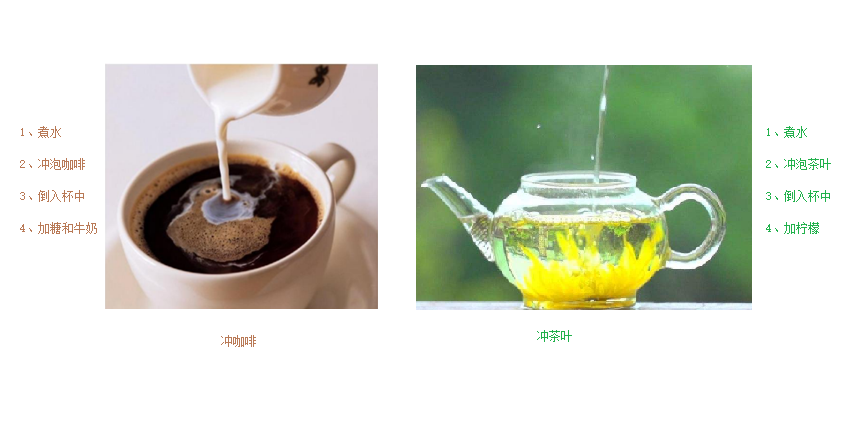

#### 4.7.1 多态的基本概念

**多态是C++面向对象三大特性之一**

多态分为两类

- 静态多态: 函数重载 和 运算符重载属于静态多态，复用函数名
- 动态多态: 派生类和虚函数实现运行时多态

静态多态和动态多态区别：

- 静态多态的函数地址早绑定  -  编译阶段确定函数地址
- 动态多态的函数地址晚绑定  -  运行阶段确定函数地址

下面通过案例进行讲解多态

```c++
#include<iostream>

class Animal1
{
public:
    //Speak函数就是虚函数
    //函数前面加上virtual关键字，变成虚函数，那么编译器在编译的时候就不能确定函数调用了。
    virtual void speak()
    {
        std::cout << "动物在说话" << std::endl;
    }
};

class Cat1 :public Animal1
{
public:
    void speak()
    {
        std::cout << "小猫在说话" << std::endl;
    }
};

class Dog1 :public Animal1
{
public:

    void speak()
    {
        std::cout << "小狗在说话" << std::endl;
    }

};
//我们希望传入什么对象，那么就调用什么对象的函数
//如果函数地址在编译阶段就能确定，那么静态联编
//如果函数地址在运行阶段才能确定，就是动态联编

void DoSpeak1(Animal1& animal)
{
    animal.speak();
}
//
//多态满足条件： 
//1、有继承关系
//2、子类重写父类中的虚函数
//多态使用：
//父类指针或引用指向子类对象

void test1()
{
    Cat1 cat;
    DoSpeak1(cat);

    Dog1 dog;
    DoSpeak1(dog);
}

int main() {

    test1();

    return 0;
}
```

总结：

多态满足条件

- 有继承关系
- 子类重写父类中的虚函数

多态使用条件

- 父类指针或引用指向子类对象

重写：函数返回值类型  函数名 参数列表 完全一致称为重写

#### 4.7.2 多态案例一-计算器类

案例描述：

分别利用普通写法和多态技术，设计实现两个操作数进行运算的计算器类

多态的优点：

- 代码组织结构清晰
- 可读性强
- 利于前期和后期的扩展以及维护

**示例** ：

```c++
#include<iostream>
#include<string>

//普通实现
class Calculator2 {
public:
    int getResult(std::string oper)
    {
        if (oper == "+") {
            return m_Num1 + m_Num2;
        }
        else if (oper == "-") {
            return m_Num1 - m_Num2;
        }
        else if (oper == "*") {
            return m_Num1 * m_Num2;
        }
        else {
            return 0;
        }
        //如果要提供新的运算，需要修改源码
    }
public:
    int m_Num1;
    int m_Num2;
};

void test21()
{
    //普通实现测试
    Calculator2 c;
    c.m_Num1 = 10;
    c.m_Num2 = 10;
    std::cout << c.m_Num1 << " + " << c.m_Num2 << " = " << c.getResult("+") << std::endl;

    std::cout << c.m_Num1 << " - " << c.m_Num2 << " = " << c.getResult("-") << std::endl;

    std::cout << c.m_Num1 << " * " << c.m_Num2 << " = " << c.getResult("*") << std::endl;
}

//多态实现
//抽象计算器类
//多态优点：代码组织结构清晰，可读性强，利于前期和后期的扩展以及维护
class AbstractCalculator2
{
public:

    virtual int getResult()
    {
        return 0;
    }

    int m_Num1;
    int m_Num2;
};

//加法计算器
class AddCalculator2 :public AbstractCalculator2
{
public:
    int getResult()
    {
        return m_Num1 + m_Num2;
    }
};

//减法计算器
class SubCalculator2 :public AbstractCalculator2
{
public:
    int getResult()
    {
        return m_Num1 - m_Num2;
    }
};

//乘法计算器
class MulCalculator2 :public AbstractCalculator2
{
public:
    int getResult()
    {
        return m_Num1 * m_Num2;
    }
};

void test22()
{
    //创建加法计算器
    AbstractCalculator2* abc = new AddCalculator2;
    abc->m_Num1 = 10;
    abc->m_Num2 = 10;
    std::cout << abc->m_Num1 << " + " << abc->m_Num2 << " = " << abc->getResult() << std::endl;
    delete abc;  //用完了记得销毁

    //创建减法计算器
    abc = new SubCalculator2;
    abc->m_Num1 = 10;
    abc->m_Num2 = 10;
    std::cout << abc->m_Num1 << " - " << abc->m_Num2 << " = " << abc->getResult() << std::endl;
    delete abc;

    //创建乘法计算器
    abc = new MulCalculator2;
    abc->m_Num1 = 10;
    abc->m_Num2 = 10;
    std::cout << abc->m_Num1 << " * " << abc->m_Num2 << " = " << abc->getResult() << std::endl;
    delete abc;
}

int main() {

    //test21();

    test22();

    return 0;
}
```

> 总结：C++开发提倡利用多态设计程序架构，因为多态优点很多

#### 4.7.3 纯虚函数和抽象类

在多态中，通常父类中虚函数的实现是毫无意义的，主要都是调用子类重写的内容

因此可以将虚函数改为**纯虚函数**

纯虚函数语法：`virtual 返回值类型 函数名 （参数列表）= 0 ;`

当类中有了纯虚函数，这个类也称为**抽象类**

**抽象类特点**：

- 无法实例化对象
- 子类必须重写抽象类中的纯虚函数，否则也属于抽象类

**示例** ：

```c++
#include<iostream>

class Base3
{
public:
    //纯虚函数
    //类中只要有一个纯虚函数就称为抽象类
    //抽象类无法实例化对象
    //子类必须重写父类中的纯虚函数，否则也属于抽象类
    virtual void func() = 0;
};

class Son3 :public Base3
{
public:
    void func()
    {
        std::cout << "func调用" << std::endl;
    };
};

void test31()
{
    Base3* base = NULL;
    //base = new Base3; // 错误，抽象类无法实例化对象
    base = new Son3;
    base->func();
    delete base;//记得销毁
}

int main() {

    test31();

    return 0;
}
```

#### 4.7.4 多态案例二-制作饮品

**案例描述** ：

制作饮品的大致流程为：煮水 -  冲泡 - 倒入杯中 - 加入辅料

利用多态技术实现本案例，提供抽象制作饮品基类，提供子类制作咖啡和茶叶



**示例** ：

```c++
#include<iostream>

//抽象制作饮品
class AbstractDrinking {
public:
    //烧水
    virtual void Boil() = 0;
    //冲泡
    virtual void Brew() = 0;
    //倒入杯中
    virtual void PourInCup() = 0;
    //加入辅料
    virtual void PutSomething() = 0;
    //规定流程
    void MakeDrink() {
        Boil();
        Brew();
        PourInCup();
        PutSomething();
    }
};

//制作咖啡
class Coffee : public AbstractDrinking {
public:
    //烧水
    virtual void Boil() {
        std::cout << "煮农夫山泉!" << std::endl;
    }
    //冲泡
    virtual void Brew() {
        std::cout << "冲泡咖啡!" << std::endl;
    }
    //倒入杯中
    virtual void PourInCup() {
        std::cout << "将咖啡倒入杯中!" << std::endl;
    }
    //加入辅料
    virtual void PutSomething() {
        std::cout << "加入牛奶!" << std::endl;
    }
};

//制作茶水
class Tea : public AbstractDrinking {
public:
    //烧水
    virtual void Boil() {
        std::cout << "煮自来水!" << std::endl;
    }
    //冲泡
    virtual void Brew() {
        std::cout << "冲泡茶叶!" << std::endl;
    }
    //倒入杯中
    virtual void PourInCup() {
        std::cout << "将茶水倒入杯中!" << std::endl;
    }
    //加入辅料
    virtual void PutSomething() {
        std::cout << "加入枸杞!" << std::endl;
    }
};

//业务函数
void DoWork(AbstractDrinking* drink) {
    drink->MakeDrink();
    delete drink;
}

void test41() {
    DoWork(new Coffee);
    std::cout << "--------------" << std::endl;
    DoWork(new Tea);
}

int main() {

    test41();

    return 0;
}
```

#### 4.7.5 虚析构和纯虚析构

多态使用时，如果子类中有属性开辟到堆区，那么父类指针在释放时无法调用到子类的析构代码

解决方式：将父类中的析构函数改为**虚析构**或者**纯虚析构**

虚析构和纯虚析构共性：

- 可以解决父类指针释放子类对象
- 都需要有具体的函数实现

虚析构和纯虚析构区别：

- 如果是纯虚析构，该类属于抽象类，无法实例化对象

虚析构语法：

`virtual ~类名(){}`

纯虚析构语法：

` virtual ~类名() = 0;`

`类名::~类名(){}`

**示例** ：

```c++
#include<iostream>
#include<string>

class Animal {
public:

    Animal()
    {
        std::cout << "Animal 构造函数调用！" << std::endl;
    }
    virtual void Speak() = 0;

    //析构函数加上virtual关键字，变成虚析构函数
    //virtual ~Animal()
    //{
    //	std::cout << "Animal虚析构函数调用！" << std::endl;
    //}

    virtual ~Animal() = 0;
};

Animal::~Animal()
{
    std::cout << "Animal 纯虚析构函数调用！" << std::endl;
}

//和包含普通纯虚函数的类一样，包含了纯虚析构函数的类也是一个抽象类。不能够被实例化。

class Cat : public Animal {
public:
    Cat(std::string name)
    {
        std::cout << "Cat构造函数调用！" << std::endl;
        m_Name = new std::string(name);
    }
    virtual void Speak()
    {
        std::cout << *m_Name << "小猫在说话!" << std::endl;
    }
    ~Cat()
    {
        std::cout << "Cat析构函数调用!" << std::endl;
        if (this->m_Name != NULL) {
            delete m_Name;
            m_Name = NULL;
        }
    }

public:
    std::string* m_Name;
};

void test51()
{
    Animal* animal = new Cat("Tom");
    animal->Speak();

    //通过父类指针去释放，会导致子类对象可能清理不干净，造成内存泄漏
    //怎么解决？给基类增加一个虚析构函数
    //虚析构函数就是用来解决通过父类指针释放子类对象
    delete animal;
}

int main() {

    test51();

    return 0;
}
```

总结：

1. 虚析构或纯虚析构就是用来解决通过父类指针释放子类对象
2. 如果子类中没有堆区数据，可以不写为虚析构或纯虚析构
3. 拥有纯虚析构函数的类也属于抽象类

#### 4.7.6 多态案例三-电脑组装

**案例描述** ：

电脑主要组成部件为 CPU（用于计算），显卡（用于显示），内存条（用于存储）

将每个零件封装出抽象基类，并且提供不同的厂商生产不同的零件，例如Intel厂商和Lenovo厂商

创建电脑类提供让电脑工作的函数，并且调用每个零件工作的接口

测试时组装三台不同的电脑进行工作

**示例** ：

```c++
#include<iostream>
using namespace std;

//抽象CPU类
class CPU
{
public:
    //抽象的计算函数
    virtual void calculate() = 0;
};

//抽象显卡类
class VideoCard
{
public:
    //抽象的显示函数
    virtual void display() = 0;
};

//抽象内存条类
class Memory
{
public:
    //抽象的存储函数
    virtual void storage() = 0;
};

//电脑类
class Computer
{
public:
    Computer(CPU* cpu, VideoCard* vc, Memory* mem)
    {
        m_cpu = cpu;
        m_vc = vc;
        m_mem = mem;
    }

    //提供工作的函数
    void work()
    {
        //让零件工作起来，调用接口
        m_cpu->calculate();

        m_vc->display();

        m_mem->storage();
    }

    //提供析构函数 释放3个电脑零件
    ~Computer()
    {

        //释放CPU零件
        if (m_cpu != NULL)
        {
            delete m_cpu;
            m_cpu = NULL;
        }

        //释放显卡零件
        if (m_vc != NULL)
        {
            delete m_vc;
            m_vc = NULL;
        }

        //释放内存条零件
        if (m_mem != NULL)
        {
            delete m_mem;
            m_mem = NULL;
        }
    }

private:

    CPU* m_cpu; //CPU的零件指针
    VideoCard* m_vc; //显卡零件指针
    Memory* m_mem; //内存条零件指针
};

//具体厂商
//Intel厂商
class IntelCPU :public CPU
{
public:
    virtual void calculate()
    {
        std::cout << "Intel的CPU开始计算了！" << std::endl;
    }
};

class IntelVideoCard :public VideoCard
{
public:
    virtual void display()
    {
        std::cout << "Intel的显卡开始显示了！" << std::endl;
    }
};

class IntelMemory :public Memory
{
public:
    virtual void storage()
    {
        std::cout << "Intel的内存条开始存储了！" << std::endl;
    }
};

//Lenovo厂商
class LenovoCPU :public CPU
{
public:
    virtual void calculate()
    {
        std::cout << "Lenovo的CPU开始计算了！" << std::endl;
    }
};

class LenovoVideoCard :public VideoCard
{
public:
    virtual void display()
    {
        std::cout << "Lenovo的显卡开始显示了！" << std::endl;
    }
};

class LenovoMemory :public Memory
{
public:
    virtual void storage()
    {
        std::cout << "Lenovo的内存条开始存储了！" << std::endl;
    }
};

void test01()
{
    //第一台电脑零件
    CPU* intelCpu = new IntelCPU;
    VideoCard* intelCard = new IntelVideoCard;
    Memory* intelMem = new IntelMemory;

    std::cout << "第一台电脑开始工作：" << std::endl;
    //创建第一台电脑
    Computer* computer1 = new Computer(intelCpu, intelCard, intelMem);
    computer1->work();
    delete computer1;

    std::cout << "-----------------------" << std::endl;
    std::cout << "第二台电脑开始工作：" << std::endl;
    //第二台电脑组装
    Computer* computer2 = new Computer(new LenovoCPU, new LenovoVideoCard, new LenovoMemory);;
    computer2->work();
    delete computer2;

    std::cout << "-----------------------" << std::endl;
    std::cout << "第三台电脑开始工作：" << std::endl;
    //第三台电脑组装
    Computer* computer3 = new Computer(new LenovoCPU, new IntelVideoCard, new LenovoMemory);;
    computer3->work();
    delete computer3;

}

int main() {

    test01();

    return 0;
}
```
